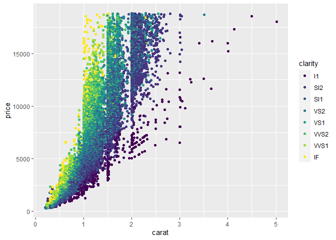
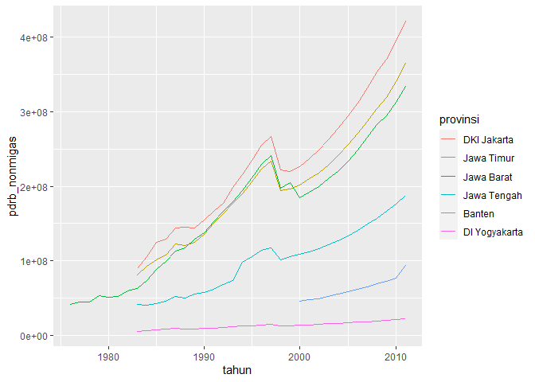
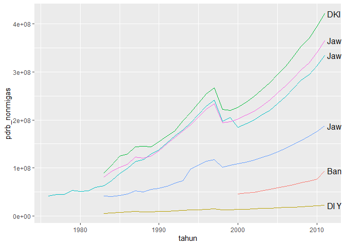
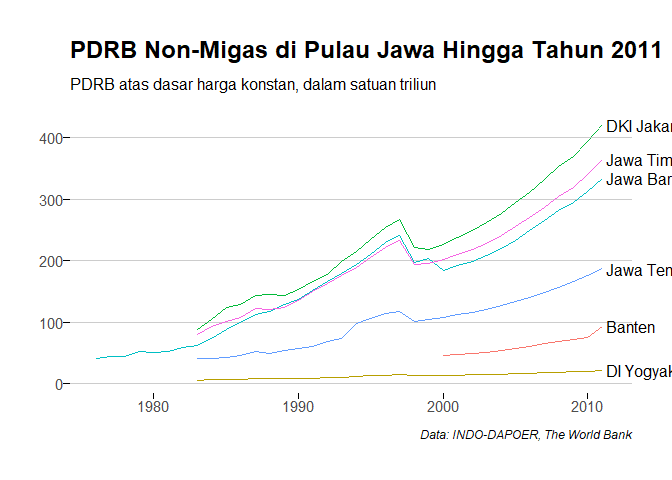

Advanced Data Visualization with ggplot2 using R
================

Konsep Grammar of Graphic

``` r
library(ggplot2)
```

Mengingat Kembali

``` r
library(ggplot2)
qplot(x = carat, y = price, colour = clarity, data = diamonds)
```

<!-- -->

Pembuatan Grafik dengan ggplot

``` r
library(ggplot2)
ggplot(data = diamonds,
       mapping = aes(x = carat, y = price, colour = clarity)) +
  geom_point()
```

<!-- -->

Kode 3 Rupa

``` r
library(ggplot2)
# Cara 1
diamonds_c1 <- 
  ggplot(data = diamonds,
         mapping = aes(x = carat, y = price, colour = clarity)) +
  geom_point()

summary(diamonds_c1)
```

    ## data: carat, cut, color, clarity, depth, table, price, x, y, z
    ##   [53940x10]
    ## mapping:  x = ~carat, y = ~price, colour = ~clarity
    ## faceting: <ggproto object: Class FacetNull, Facet, gg>
    ##     compute_layout: function
    ##     draw_back: function
    ##     draw_front: function
    ##     draw_labels: function
    ##     draw_panels: function
    ##     finish_data: function
    ##     init_scales: function
    ##     map_data: function
    ##     params: list
    ##     setup_data: function
    ##     setup_params: function
    ##     shrink: TRUE
    ##     train_scales: function
    ##     vars: function
    ##     super:  <ggproto object: Class FacetNull, Facet, gg>
    ## -----------------------------------
    ## geom_point: na.rm = FALSE
    ## stat_identity: na.rm = FALSE
    ## position_identity

``` r
# Cara 2
diamonds_c2 <- 
  ggplot(data = diamonds) +
    geom_point(mapping = aes(x = carat, y = price, colour = clarity))

summary(diamonds_c2)
```

    ## data: carat, cut, color, clarity, depth, table, price, x, y, z
    ##   [53940x10]
    ## faceting: <ggproto object: Class FacetNull, Facet, gg>
    ##     compute_layout: function
    ##     draw_back: function
    ##     draw_front: function
    ##     draw_labels: function
    ##     draw_panels: function
    ##     finish_data: function
    ##     init_scales: function
    ##     map_data: function
    ##     params: list
    ##     setup_data: function
    ##     setup_params: function
    ##     shrink: TRUE
    ##     train_scales: function
    ##     vars: function
    ##     super:  <ggproto object: Class FacetNull, Facet, gg>
    ## -----------------------------------
    ## mapping: x = ~carat, y = ~price, colour = ~clarity 
    ## geom_point: na.rm = FALSE
    ## stat_identity: na.rm = FALSE
    ## position_identity

``` r
# Cara 3
diamonds_c3 <- 
  ggplot() +
  geom_point(
    data = diamonds,
    mapping = aes(x = carat, y = price, colour = clarity)
    )

summary(diamonds_c3)
```

    ## data: [x]
    ## faceting: <ggproto object: Class FacetNull, Facet, gg>
    ##     compute_layout: function
    ##     draw_back: function
    ##     draw_front: function
    ##     draw_labels: function
    ##     draw_panels: function
    ##     finish_data: function
    ##     init_scales: function
    ##     map_data: function
    ##     params: list
    ##     setup_data: function
    ##     setup_params: function
    ##     shrink: TRUE
    ##     train_scales: function
    ##     vars: function
    ##     super:  <ggproto object: Class FacetNull, Facet, gg>
    ## -----------------------------------
    ## mapping: x = ~carat, y = ~price, colour = ~clarity 
    ## geom_point: na.rm = FALSE
    ## stat_identity: na.rm = FALSE
    ## position_identity

Komponen grafik : Data Mapping Statistic Scales Geometries Facets
Coordinates Theme

Yin dan Yang

``` r
library(dplyr)  
```

    ## 
    ## Attaching package: 'dplyr'

    ## The following objects are masked from 'package:stats':
    ## 
    ##     filter, lag

    ## The following objects are masked from 'package:base':
    ## 
    ##     intersect, setdiff, setequal, union

Paket dplyr Terdapat beberapa fungsi utama dari paket dplyr untuk
melakukan transformasi data, diantaranya:

select() filter() arrange() mutate() summarise() group\_by()

``` r
TRUE
```

    ## [1] TRUE

Transformasi Data

``` r
library(dplyr)
glimpse(storms)
```

    ## Rows: 10,010
    ## Columns: 13
    ## $ name        <chr> "Amy", "Amy", "Amy", "Amy", "Amy", "Amy", "Amy", "Amy",...
    ## $ year        <dbl> 1975, 1975, 1975, 1975, 1975, 1975, 1975, 1975, 1975, 1...
    ## $ month       <dbl> 6, 6, 6, 6, 6, 6, 6, 6, 6, 6, 6, 6, 6, 6, 6, 6, 7, 7, 7...
    ## $ day         <int> 27, 27, 27, 27, 28, 28, 28, 28, 29, 29, 29, 29, 30, 30,...
    ## $ hour        <dbl> 0, 6, 12, 18, 0, 6, 12, 18, 0, 6, 12, 18, 0, 6, 12, 18,...
    ## $ lat         <dbl> 27.5, 28.5, 29.5, 30.5, 31.5, 32.4, 33.3, 34.0, 34.4, 3...
    ## $ long        <dbl> -79.0, -79.0, -79.0, -79.0, -78.8, -78.7, -78.0, -77.0,...
    ## $ status      <chr> "tropical depression", "tropical depression", "tropical...
    ## $ category    <ord> -1, -1, -1, -1, -1, -1, -1, -1, 0, 0, 0, 0, 0, 0, 0, 0,...
    ## $ wind        <int> 25, 25, 25, 25, 25, 25, 25, 30, 35, 40, 45, 50, 50, 55,...
    ## $ pressure    <int> 1013, 1013, 1013, 1013, 1012, 1012, 1011, 1006, 1004, 1...
    ## $ ts_diameter <dbl> NA, NA, NA, NA, NA, NA, NA, NA, NA, NA, NA, NA, NA, NA,...
    ## $ hu_diameter <dbl> NA, NA, NA, NA, NA, NA, NA, NA, NA, NA, NA, NA, NA, NA,...

``` r
# Tanpa menggunakan %>% 

storms1 <- select(storms, year, month, wind, pressure)
storms2 <- filter(storms1, between(year, 2000, 2015))
storms3 <- mutate(storms2, month = factor(month.name[storms2$month], levels = month.name))
storms4 <- group_by(storms3, month)
storms_nopipe <- summarise(storms4, avg_wind = mean(wind), avg_pressure = mean(pressure))
```

    ## `summarise()` ungrouping output (override with `.groups` argument)

``` r
glimpse(storms_nopipe)
```

    ## Rows: 10
    ## Columns: 3
    ## $ month        <fct> January, April, May, June, July, August, September, Oc...
    ## $ avg_wind     <dbl> 45.65217, 44.61538, 36.76471, 39.03030, 48.21981, 51.9...
    ## $ avg_pressure <dbl> 999.4348, 996.9231, 1003.4510, 999.5333, 999.1300, 994...

``` r
# Menggunakan %>% 

storms_pipe <-
  storms %>%
  select(year, month, wind, pressure) %>%
  filter(between(year, 2000, 2015)) %>%
  mutate(month = factor(month.name[month], levels = month.name)) %>%
  group_by(month) %>%
  summarise(
    avg_wind = mean(wind),
    avg_pressure = mean(pressure)
  )
```

    ## `summarise()` ungrouping output (override with `.groups` argument)

``` r
glimpse(storms_pipe) 
```

    ## Rows: 10
    ## Columns: 3
    ## $ month        <fct> January, April, May, June, July, August, September, Oc...
    ## $ avg_wind     <dbl> 45.65217, 44.61538, 36.76471, 39.03030, 48.21981, 51.9...
    ## $ avg_pressure <dbl> 999.4348, 996.9231, 1003.4510, 999.5333, 999.1300, 994...

``` r
# Komparasi metode tanpa pipe dan dengan pipe
identical(storms_nopipe, storms_pipe) 
```

    ## [1] TRUE

Operator Pipe

``` r
storms %>%
  select(year, month, wind, pressure) %>%
  filter(between(year, 2000, 2015)) %>%
  mutate(month = factor(month.name[month], levels = month.name)) %>%
  group_by(month) %>%
  summarise(
    avg_wind = mean(wind),
    avg_pressure = mean(pressure)
  )
```

    ## `summarise()` ungrouping output (override with `.groups` argument)

    ## # A tibble: 10 x 3
    ##    month     avg_wind avg_pressure
    ##    <fct>        <dbl>        <dbl>
    ##  1 January       45.7         999.
    ##  2 April         44.6         997.
    ##  3 May           36.8        1003.
    ##  4 June          39.0         999.
    ##  5 July          48.2         999.
    ##  6 August        52.0         994.
    ##  7 September     58.3         988.
    ##  8 October       55.7         990.
    ##  9 November      56.5         990.
    ## 10 December      46.8         997.

Import Dataset

``` r
library(readr)

indodapoer <- read_tsv("https://storage.googleapis.com/dqlab-dataset/indodapoer.tsv.gz")
```

    ## 
    ## -- Column specification --------------------------------------------------------
    ## cols(
    ##   .default = col_double(),
    ##   area_name = col_character(),
    ##   `Import: Commodities and transaction not elsewhere classified (province Level, in USD)` = col_logical(),
    ##   `Length of National Road: Dirt (in km) (BPS Data, Province only)` = col_logical(),
    ##   `Length of National Road: Other (in km) (BPS Data, Province only)` = col_logical(),
    ##   `Total Natural Resources Revenue Sharing from Geothermal  Energy (in IDR, realization value)` = col_logical(),
    ##   `Total Revenue Sharing` = col_logical(),
    ##   `Total Specific Allocation Grant for Village (in IDR Billion)` = col_logical()
    ## )
    ## i Use `spec()` for the full column specifications.

    ## Warning: 232 parsing failures.
    ##  row                                                                                   col           expected  actual                                                             file
    ## 1008 Import: Commodities and transaction not elsewhere classified (province Level, in USD) 1/0/T/F/TRUE/FALSE 554693  'https://storage.googleapis.com/dqlab-dataset/indodapoer.tsv.gz'
    ## 1009 Import: Commodities and transaction not elsewhere classified (province Level, in USD) 1/0/T/F/TRUE/FALSE 1291450 'https://storage.googleapis.com/dqlab-dataset/indodapoer.tsv.gz'
    ## 1010 Import: Commodities and transaction not elsewhere classified (province Level, in USD) 1/0/T/F/TRUE/FALSE 365356  'https://storage.googleapis.com/dqlab-dataset/indodapoer.tsv.gz'
    ## 1011 Import: Commodities and transaction not elsewhere classified (province Level, in USD) 1/0/T/F/TRUE/FALSE 216478  'https://storage.googleapis.com/dqlab-dataset/indodapoer.tsv.gz'
    ## 1012 Import: Commodities and transaction not elsewhere classified (province Level, in USD) 1/0/T/F/TRUE/FALSE 646310  'https://storage.googleapis.com/dqlab-dataset/indodapoer.tsv.gz'
    ## .... ..................................................................................... .................. ....... ................................................................
    ## See problems(...) for more details.

``` r
nrow(indodapoer)
```

    ## [1] 22468

``` r
ncol(indodapoer)
```

    ## [1] 222

Wild Names and How to Tame Them

``` r
#install.packages("janitor", repos = "http://cran.us.r-project.org")
library(janitor)
```

    ## Warning: package 'janitor' was built under R version 4.0.5

    ## 
    ## Attaching package: 'janitor'

    ## The following objects are masked from 'package:stats':
    ## 
    ##     chisq.test, fisher.test

``` r
head(colnames(indodapoer), 15)
```

    ##  [1] "area_name"                                                                                                  
    ##  [2] "year"                                                                                                       
    ##  [3] "Agriculture function expenditure (in IDR)"                                                                  
    ##  [4] "Average National Exam Score: Junior Secondary Level (out of 100, available only in district level for 2009)"
    ##  [5] "Average National Exam Score: Primary Level (out of 100, available only in district level for 2009)"         
    ##  [6] "Average National Exam Score: Senior Secondary Level (out of 100, available only in district level for 2009)"
    ##  [7] "Birth attended by Skilled Health worker (in % of total birth)"                                              
    ##  [8] "BPK Audit Report on Sub-National Budget"                                                                    
    ##  [9] "Capital expenditure (in IDR)"                                                                               
    ## [10] "Consumer Price Index in 42 cities base 1996"                                                                
    ## [11] "Consumer Price Index in 45 cities base 2002"                                                                
    ## [12] "Consumer Price Index in 66 cities base 2007"                                                                
    ## [13] "Economy function expenditure (in IDR)"                                                                      
    ## [14] "Education function expenditure (in IDR)"                                                                    
    ## [15] "Environment function expenditure (in IDR)"

``` r
indodapoer <- clean_names(indodapoer)
head(colnames(indodapoer), 15)
```

    ##  [1] "area_name"                                                                                              
    ##  [2] "year"                                                                                                   
    ##  [3] "agriculture_function_expenditure_in_idr"                                                                
    ##  [4] "average_national_exam_score_junior_secondary_level_out_of_100_available_only_in_district_level_for_2009"
    ##  [5] "average_national_exam_score_primary_level_out_of_100_available_only_in_district_level_for_2009"         
    ##  [6] "average_national_exam_score_senior_secondary_level_out_of_100_available_only_in_district_level_for_2009"
    ##  [7] "birth_attended_by_skilled_health_worker_in_percent_of_total_birth"                                      
    ##  [8] "bpk_audit_report_on_sub_national_budget"                                                                
    ##  [9] "capital_expenditure_in_idr"                                                                             
    ## [10] "consumer_price_index_in_42_cities_base_1996"                                                            
    ## [11] "consumer_price_index_in_45_cities_base_2002"                                                            
    ## [12] "consumer_price_index_in_66_cities_base_2007"                                                            
    ## [13] "economy_function_expenditure_in_idr"                                                                    
    ## [14] "education_function_expenditure_in_idr"                                                                  
    ## [15] "environment_function_expenditure_in_idr"

Produk Domestik Regional Bruto

``` r
library(stringr)
library(dplyr)
pdrb_pjawa <-
  indodapoer %>%
  filter(
    area_name %in% c(
      "Banten, Prop.",
      "DKI Jakarta, Prop.",
      "Jawa Barat, Prop.",
      "Jawa Tengah, Prop.",
      "DI Yogyakarta, Prop.",
      "Jawa Timur, Prop."
    )
  ) %>%
  transmute(
    provinsi = str_remove(area_name, ", Prop."),
    tahun = year,
    pdrb_nonmigas = total_gdp_excluding_oil_and_gas_in_idr_million_constant_price
  ) %>%
  filter(!is.na(pdrb_nonmigas))
glimpse(pdrb_pjawa)
```

    ## Rows: 164
    ## Columns: 3
    ## $ provinsi      <chr> "Banten", "Banten", "Banten", "Banten", "Banten", "Ba...
    ## $ tahun         <dbl> 2000, 2001, 2002, 2003, 2004, 2005, 2006, 2007, 2008,...
    ## $ pdrb_nonmigas <dbl> 45690559, 47495383, 49449321, 51957458, 54880407, 581...

Grafik PDRB Non-Migas

``` r
library(dplyr)
library(ggplot2)
library(forcats)
```

    ## Warning: package 'forcats' was built under R version 4.0.5

``` r
pdrb_pjawa %>%
  mutate(
    provinsi = fct_reorder2(provinsi, tahun, pdrb_nonmigas)
  ) %>%
  ggplot(aes(tahun, pdrb_nonmigas, colour = provinsi)) +
  geom_line()
```

<!-- -->

Direct Labeling

``` r
library(ggplot2)
library(dplyr)
library(directlabels)
```

    ## Warning: package 'directlabels' was built under R version 4.0.5

``` r
pdrb_pjawa %>% 
  ggplot(aes(tahun, pdrb_nonmigas)) +
  geom_line(aes(colour = provinsi), show.legend = FALSE) +
  geom_dl(
    aes(label = provinsi), 
    method = "last.points",
    position = position_nudge(x = 0.3) # agar teks tidak berhimpitan dengan garis
  )
```

<!-- -->

Finalisasi Grafik

``` r
library(ggplot2)
library(dplyr)
library(directlabels)
library(hrbrthemes)
```

    ## Warning: package 'hrbrthemes' was built under R version 4.0.5

    ## NOTE: Either Arial Narrow or Roboto Condensed fonts are required to use these themes.

    ##       Please use hrbrthemes::import_roboto_condensed() to install Roboto Condensed and

    ##       if Arial Narrow is not on your system, please see https://bit.ly/arialnarrow

``` r
pdrb_pjawa %>% 
  ggplot(aes(tahun, pdrb_nonmigas / 1e6)) +
  geom_line(aes(colour = provinsi), show.legend = FALSE) +
  geom_dl(
    aes(label = provinsi), 
    method = "last.points",
    position = position_nudge(x = 0.3) # agar teks tidak berhimpitan dengan garis
  ) +
  labs(
    x = NULL,
    y = NULL,
    title = "PDRB Non-Migas di Pulau Jawa Hingga Tahun 2011",
    subtitle = "PDRB atas dasar harga konstan, dalam satuan triliun",
    caption =  "Data: INDO-DAPOER, The World Bank"
  ) +
  coord_cartesian(clip = "off") +
  theme_ipsum(grid = "Y", ticks = TRUE)
```

    ## Warning in grid.Call(C_stringMetric, as.graphicsAnnot(x$label)): font family not
    ## found in Windows font database

    ## Warning in grid.Call(C_stringMetric, as.graphicsAnnot(x$label)): font family not
    ## found in Windows font database
    
    ## Warning in grid.Call(C_stringMetric, as.graphicsAnnot(x$label)): font family not
    ## found in Windows font database
    
    ## Warning in grid.Call(C_stringMetric, as.graphicsAnnot(x$label)): font family not
    ## found in Windows font database

    ## Warning in grid.Call(C_textBounds, as.graphicsAnnot(x$label), x$x, x$y, : font
    ## family not found in Windows font database
    
    ## Warning in grid.Call(C_textBounds, as.graphicsAnnot(x$label), x$x, x$y, : font
    ## family not found in Windows font database
    
    ## Warning in grid.Call(C_textBounds, as.graphicsAnnot(x$label), x$x, x$y, : font
    ## family not found in Windows font database
    
    ## Warning in grid.Call(C_textBounds, as.graphicsAnnot(x$label), x$x, x$y, : font
    ## family not found in Windows font database
    
    ## Warning in grid.Call(C_textBounds, as.graphicsAnnot(x$label), x$x, x$y, : font
    ## family not found in Windows font database
    
    ## Warning in grid.Call(C_textBounds, as.graphicsAnnot(x$label), x$x, x$y, : font
    ## family not found in Windows font database
    
    ## Warning in grid.Call(C_textBounds, as.graphicsAnnot(x$label), x$x, x$y, : font
    ## family not found in Windows font database
    
    ## Warning in grid.Call(C_textBounds, as.graphicsAnnot(x$label), x$x, x$y, : font
    ## family not found in Windows font database
    
    ## Warning in grid.Call(C_textBounds, as.graphicsAnnot(x$label), x$x, x$y, : font
    ## family not found in Windows font database
    
    ## Warning in grid.Call(C_textBounds, as.graphicsAnnot(x$label), x$x, x$y, : font
    ## family not found in Windows font database
    
    ## Warning in grid.Call(C_textBounds, as.graphicsAnnot(x$label), x$x, x$y, : font
    ## family not found in Windows font database
    
    ## Warning in grid.Call(C_textBounds, as.graphicsAnnot(x$label), x$x, x$y, : font
    ## family not found in Windows font database
    
    ## Warning in grid.Call(C_textBounds, as.graphicsAnnot(x$label), x$x, x$y, : font
    ## family not found in Windows font database

<!-- -->
