Data Visualization in Data Science using R
================

Membuat Kanvas Kosong

``` r
library(ggplot2)
#Ketik function ggplot() di bawah ini
ggplot()
```

<!-- -->

Menambahkan Judul

``` r
library(ggplot2)

#Penambahan judul dengan menggunakan fungsi labs
ggplot() + labs(title="Luas Wilayah vs Kepadatan Penduduk DKI Jakarta - Periode 2013")
```

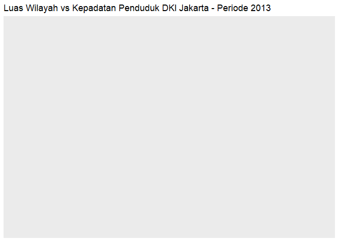<!-- -->

Plot disimpan sebagai Variable

``` r
library(ggplot2)
plot.jakarta <- ggplot()
plot.jakarta <- plot.jakarta + labs(title="Luas Wilayah vs Kepadatan Penduduk DKI Jakarta - Periode 2013")
plot.jakarta
```

<!-- -->

Menambahkan Label pada Sumbu X dan Y

``` r
library(ggplot2)
plot.jakarta <- ggplot()
plot.jakarta <- plot.jakarta + labs(title="Luas Wilayah vs Kepadatan Penduduk DKI Jakarta - Periode 2013", subtitle="Tahun 2013")
plot.jakarta <- plot.jakarta  + labs(x=" Luas Wilayah (km2)", y = "Kepadatan Jiwa per km2")
plot.jakarta
```

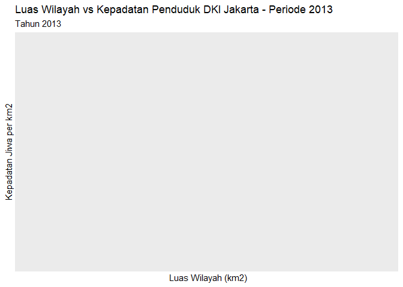<!-- -->

Fungsi summary untuk objek ggplot

``` r
library(ggplot2)
plot.jakarta <- ggplot()
plot.jakarta <- plot.jakarta + labs(title="Luas Wilayah vs Kepadatan Penduduk DKI Jakarta")
plot.jakarta <- plot.jakarta + labs(x = "Luas Wilayah (km2)", y="Kepadatan Jiwa per km2")
summary(plot.jakarta)
```

    ## data: [x]
    ## faceting: <ggproto object: Class FacetNull, Facet, gg>
    ##     compute_layout: function
    ##     draw_back: function
    ##     draw_front: function
    ##     draw_labels: function
    ##     draw_panels: function
    ##     finish_data: function
    ##     init_scales: function
    ##     map_data: function
    ##     params: list
    ##     setup_data: function
    ##     setup_params: function
    ##     shrink: TRUE
    ##     train_scales: function
    ##     vars: function
    ##     super:  <ggproto object: Class FacetNull, Facet, gg>

Membaca Dataset Kependudukan dengan read.csv

``` r
library(ggplot2)
#Membaca data csv dan dimasukkan ke variable penduduk.dki
penduduk.dki <- read.csv("https://storage.googleapis.com/dqlab-dataset/dkikepadatankelurahan2013.csv", sep=",")
# Tampilkan data frame dari kolom " NAMA.KELURAHAN " dan "LUAS.WILAYAH..KM2."
penduduk.dki[c("NAMA.KELURAHAN", "LUAS.WILAYAH..KM2.")]
```

    ##             NAMA.KELURAHAN LUAS.WILAYAH..KM2.
    ## 1              P. PANGGANG               0.91
    ## 2                P. KELAPA               3.76
    ## 3               P. HARAPAN               3.59
    ## 4           P. UNTUNG JAWA               0.59
    ## 5                P. TIDUNG               1.57
    ## 6                  P. PARI               1.39
    ## 7                   GAMBIR               2.58
    ## 8                   CIDENG               1.26
    ## 9             PETOJO UTARA               1.12
    ## 10          PETOJO SELATAN               1.14
    ## 11            KEBON KELAPA               0.78
    ## 12               DURI PULO               0.72
    ## 13              PASAR BARU               1.89
    ## 14            KARANG ANYAR               0.51
    ## 15                 KARTINI               0.55
    ## 16     GUNUNG SAHARI UTARA               1.98
    ## 17      MANGGA DUA SELATAN               1.29
    ## 18               KEMAYORAN               0.55
    ## 19            KEBON KOSONG               1.13
    ## 20           HARAPAN MULIA               0.91
    ## 21                 SERDANG               0.82
    ## 22   GUNUNG SAHARI SELATAN               0.53
    ## 23            CEMPAKA BARU               0.99
    ## 24              SUMUR BATU               1.15
    ## 25            UTAN PANJANG               1.05
    ## 26                   SENEN               0.81
    ## 27                  KENARI               0.91
    ## 28                 PASEBAN               0.71
    ## 29                  KRAMAT               0.71
    ## 30                 KWITANG               0.45
    ## 31                  BUNGUR               0.64
    ## 32     CEMPAKA PUTIH TIMUR               2.22
    ## 33     CEMPAKA PUTIH BARAT               1.22
    ## 34                RAWASARI               1.25
    ## 35                 MENTENG               2.44
    ## 36              PEGANGSAAN               0.98
    ## 37                  CIKINI               0.82
    ## 38              GONDANGDIA               1.46
    ## 39             KEBON SIRIH               0.83
    ## 40                  GELORA               2.59
    ## 41         BENDUNGAN HILIR               1.58
    ## 42           KARET TENGSIN               1.53
    ## 43              PETAMBURAN               0.90
    ## 44            KEBON MELATI               1.26
    ## 45            KEBON KACANG               0.71
    ## 46            KAMPUNG BALI               0.73
    ## 47              JOHAR BARU               1.19
    ## 48            KAMPUNG RAWA               0.30
    ## 49                   GALUR               0.27
    ## 50            TANAH TINGGI               0.62
    ## 51             PENJARINGAN               3.95
    ## 52             KAMAL MUARA              10.53
    ## 53             KAPUK MUARA              10.56
    ## 54               PEJAGALAN               3.23
    ## 55                   PLUIT               7.71
    ## 56           TANJUNG PRIOK               5.59
    ## 57             SUNTER JAYA               4.68
    ## 58                PAPANGGO               2.80
    ## 59            SUNGAI BAMBU               2.36
    ## 60            KEBON BAWANG               1.73
    ## 61            SUNTER AGUNG               6.65
    ## 62                 WARAKAS               1.09
    ## 63                    KOJA               3.27
    ## 64              TUGU UTARA               2.37
    ## 65                   LAGOA               1.58
    ## 66        RAWA BADAK UTARA               1.33
    ## 67            TUGU SELATAN               1.86
    ## 68      RAWA BADAK SELATAN               1.33
    ## 69               CILINCING               8.31
    ## 70                SUKAPURA               5.61
    ## 71                 MARUNDA               7.92
    ## 72               KALI BARU               2.47
    ## 73            SEMPER TIMUR               3.17
    ## 74                 ROROTAN              10.64
    ## 75            SEMPER BARAT               4.44
    ## 76        PADEMANGAN TIMUR               2.61
    ## 77        PADEMANGAN BARAT               3.53
    ## 78                   ANCOL               5.77
    ## 79     KELAPA GADING TIMUR               5.31
    ## 80          PEGANGSAAN DUA               6.28
    ## 81     KELAPA GADING BARAT               4.53
    ## 82        CENGKARENG BARAT               4.26
    ## 83            DURI KOSAMBI               5.03
    ## 84              RAWA BUAYA               4.67
    ## 85      KEDAUNG KALI ANGKE               2.61
    ## 86                   KAPUK               7.18
    ## 87        CENGKARENG TIMUR               4.18
    ## 88                  GROGOL               1.22
    ## 89     TANJUNG DUREN UTARA               1.11
    ## 90                  TOMANG               1.88
    ## 91                JELAMBAR               1.44
    ## 92   TANJUNG DUREN SELATAN               1.76
    ## 93           JELAMBAR BARU               1.44
    ## 94           WIJAYA KUSUMA               2.61
    ## 95              TAMAN SARI               0.68
    ## 96                  KRUKUT               0.55
    ## 97                  MAPHAR               0.59
    ## 98                  TANGKI               0.37
    ## 99            MANGGA BESAR               0.51
    ## 100              KEAGUNGAN               0.32
    ## 101                 GLODOK               0.38
    ## 102              PINANGSIA               0.96
    ## 103                TAMBORA               0.28
    ## 104             KALI ANYAR               0.32
    ## 105             DURI UTARA               0.40
    ## 106           TANAH SEREAL               0.62
    ## 107              KERENDANG               0.32
    ## 108          JEMBATAN BESI               0.55
    ## 109                  ANGKE               0.80
    ## 110          JEMBATAN LIMA               0.46
    ## 111                PEKOJAN               0.78
    ## 112             ROA MALAKA               0.53
    ## 113           DURI SELATAN               0.42
    ## 114            KEBON JERUK               2.69
    ## 115         SUKABUMI UTARA               1.60
    ## 116       SUKABUMI SELATAN               1.57
    ## 117             KELAPA DUA               1.50
    ## 118              DURI KEPA               3.86
    ## 119           KEDOYA UTARA               3.14
    ## 120         KEDOYA SELATAN               2.28
    ## 121              KALIDERES               5.72
    ## 122                SEMANAN               5.98
    ## 123             TEGAL ALUR               4.00
    ## 124                  KAMAL               4.49
    ## 125             PEGADUNGAN               8.89
    ## 126               PALMERAH               2.11
    ## 127                  SLIPI               0.97
    ## 128       KOTA BAMBU UTARA               0.63
    ## 129              JATI PULO               0.87
    ## 130            KEMANGGISAN               2.33
    ## 131     KOTA BAMBU SELATAN               0.61
    ## 132        KEMBANGAN UTARA               3.65
    ## 133           MERUYA UTARA               4.76
    ## 134         MERUYA SELATAN               2.85
    ## 135              SRENGSENG               4.92
    ## 136                  JOGLO               4.86
    ## 137      KEMBANGAN SELATAN               3.60
    ## 138            TEBET TIMUR               1.39
    ## 139            TEBET BARAT               1.72
    ## 140          MENTENG DALAM               2.58
    ## 141             KEBON BARU               1.30
    ## 142             BUKIT DURI               1.08
    ## 143      MANGGARAI SELATAN               0.51
    ## 144              MANGGARAI               0.95
    ## 145             SETIA BUDI               0.94
    ## 146         KARET SEMANGGI               0.90
    ## 147         KARET KUNINGAN               1.79
    ## 148                  KARET               0.94
    ## 149           MENTENG ATAS               0.90
    ## 150          PASAR MANGGIS               0.78
    ## 151                 GUNTUR               0.65
    ## 152         KUNINGAN TIMUR               2.15
    ## 153       MAMPANG PRAPATAN               0.78
    ## 154                 BANGKA               3.30
    ## 155           PELA MAMPANG               1.62
    ## 156           TEGAL PARANG               1.06
    ## 157         KUNINGAN BARAT               0.98
    ## 158           PASAR MINGGU               2.79
    ## 159            JATI PADANG               2.50
    ## 160         CILANDAK TIMUR               3.53
    ## 161                RAGUNAN               5.05
    ## 162          PEJATEN TIMUR               2.88
    ## 163          PEJATEN BARAT               2.90
    ## 164              KEBAGUSAN               2.26
    ## 165   KEBAYORAN LAMA UTARA               1.78
    ## 166          PONDOK PINANG               6.84
    ## 167                CIPULIR               1.94
    ## 168           GROGOL UTARA               3.33
    ## 169         GROGOL SELATAN               2.85
    ## 170 KEBAYORAN LAMA SELATAN               2.57
    ## 171         CILANDAK BARAT               6.05
    ## 172            LEBAK BULUS               4.41
    ## 173            PONDOK LABU               3.61
    ## 174       GANDARIA SELATAN               1.76
    ## 175         CIPETE SELATAN               2.37
    ## 176                MELAWAI               1.26
    ## 177                 GUNUNG               1.32
    ## 178            KRAMAT PELA               1.23
    ## 179                 SELONG               1.40
    ## 180             RAWA BARAT               0.69
    ## 181                SENAYAN               1.53
    ## 182                   PULO               1.27
    ## 183              PETOGOGAN               0.86
    ## 184         GANDARIA UTARA               1.52
    ## 185           CIPETE UTARA               1.83
    ## 186               PANCORAN               1.24
    ## 187               KALIBATA               2.20
    ## 188              RAWA JATI               0.67
    ## 189             DUREN TIGA               2.45
    ## 190             PENGADEGAN               0.95
    ## 191                 CIKOKO               0.72
    ## 192              JAGAKARSA               4.85
    ## 193        SRENGSENG SAWAH               6.75
    ## 194               CIGANJUR               3.61
    ## 195          LENTENG AGUNG               2.28
    ## 196          TANJUNG BARAT               3.65
    ## 197                CIPEDAK               4.24
    ## 198           PESANGGRAHAN               2.10
    ## 199                BINTARO               4.56
    ## 200       PETUKANGAN UTARA               2.99
    ## 201     PETUKANGAN SELATAN               2.11
    ## 202                ULUJAMI               1.71
    ## 203          PISANGAN BARU               0.68
    ## 204        UTAN KAYU UTARA               1.05
    ## 205             KAYU MANIS               0.57
    ## 206             PAL MERIAM               0.65
    ## 207          KEBON MANGGIS               0.78
    ## 208      UTAN KAYU SELATAN               1.12
    ## 209            PULO GADUNG               1.29
    ## 210         PISANGAN TIMUR               1.80
    ## 211               CIPINANG               1.54
    ## 212        JATINEGARA KAUM               1.23
    ## 213             RAWAMANGUN               2.60
    ## 214             KAYU PUTIH               4.37
    ## 215                   JATI               2.15
    ## 216         KAMPUNG MELAYU               0.48
    ## 217            BIDARA CINA               1.26
    ## 218            BALI MESTER               0.67
    ## 219             RAWA BUNGA               0.88
    ## 220      CIPINANG CEMPEDAK               1.67
    ## 221         CIPINANG MUARA               2.90
    ## 222 CIPINANG BESAR SELATAN               1.63
    ## 223   CIPINANG BESAR UTARA               1.15
    ## 224            KRAMAT JATI               1.52
    ## 225         KAMPUNG TENGAH               2.03
    ## 226                  DUKUH               1.98
    ## 227             BATU AMPAR               2.55
    ## 228           BALE KAMBANG               1.67
    ## 229              CILILITAN               1.80
    ## 230                 CAWANG               1.79
    ## 231                 GEDONG               2.65
    ## 232                   BARU               1.89
    ## 233              CIJANTUNG               2.37
    ## 234               KALISARI               2.89
    ## 235                PEKAYON               3.14
    ## 236             JATINEGARA               6.60
    ## 237            RAWA TERATE               4.10
    ## 238           PENGGILINGAN               4.48
    ## 239           CAKUNG TIMUR               9.81
    ## 240            PULO GEBANG               6.86
    ## 241          UJUNG MENTENG               4.43
    ## 242           CAKUNG BARAT               6.19
    ## 243            DUREN SAWIT               4.58
    ## 244           PONDOK BAMBU               5.00
    ## 245                KLENDER               3.08
    ## 246          PONDOK KELAPA               5.72
    ## 247            MALAKA SARI               1.38
    ## 248            MALAKA JAYA               0.99
    ## 249            PONDOK KOPI               2.06
    ## 250                MAKASAR               1.85
    ## 251           PINANG RANTI               1.89
    ## 252             KEBON PALA               2.30
    ## 253  HALIM PERDANA KUSUMAH              13.07
    ## 254        CIPINANG MELAYU               2.53
    ## 255                CIRACAS               3.93
    ## 256                CIBUBUR               4.50
    ## 257       KELAPA DUA WETAN               3.37
    ## 258                SUSUKAN               2.19
    ## 259               RAMBUTAN               2.09
    ## 260               CIPAYUNG               3.08
    ## 261              CILANGKAP               6.03
    ## 262         PONDOK RANGGON               3.66
    ## 263                 MUNJUL               1.90
    ## 264                   SETU               3.25
    ## 265             BAMBU APUS               3.17
    ## 266           LUBANG BUAYA               3.72
    ## 267                  CEGER               3.63

Memasukkan Data ke Plot

``` r
library(ggplot2)
#Membaca data csv dan dimasukkan ke variable penduduk.dki
penduduk.dki <- read.csv("https://storage.googleapis.com/dqlab-dataset/dkikepadatankelurahan2013.csv", sep=",")
# Masukkan data ke dalam plot dan simpan sebagai variable plot.dki, dan tampilkan summary dari plot tersebut
plot.dki <- ggplot(data=penduduk.dki)
summary(plot.dki)
```

    ## data: TAHUN, NAMA.PROVINSI, NAMA.KABUPATEN.KOTA, NAMA.KECAMATAN,
    ##   NAMA.KELURAHAN, LUAS.WILAYAH..KM2., KEPADATAN..JIWA.KM2., X, X.1,
    ##   X.2, X.3, X.4, X.5, X.6, X.7, X.8, X.9, X.10, X.11, X35.39.Laki.Laki,
    ##   X35.39.Perempuan, X40.44.Laki.Laki, X40.44.Perempuan,
    ##   X45.49.Laki.Laki, X45.49.Perempuan, X50.54.Laki.Laki,
    ##   X50.54.Perempuan, X55.59.Laki.Laki, X55.59.Perempuan,
    ##   X60.64.Laki.Laki, X60.64.Perempuan, X65.69.Laki.Laki,
    ##   X65.69.Perempuan, X70.74.Laki.Laki, X70.74.Perempuan, X.75.Laki.Laki,
    ##   X.75..Perempuan [267x37]
    ## faceting: <ggproto object: Class FacetNull, Facet, gg>
    ##     compute_layout: function
    ##     draw_back: function
    ##     draw_front: function
    ##     draw_labels: function
    ##     draw_panels: function
    ##     finish_data: function
    ##     init_scales: function
    ##     map_data: function
    ##     params: list
    ##     setup_data: function
    ##     setup_params: function
    ##     shrink: TRUE
    ##     train_scales: function
    ##     vars: function
    ##     super:  <ggproto object: Class FacetNull, Facet, gg>

Memetakan x, y dan color dengan function aes

``` r
library(ggplot2)
#Membaca data csv dan dimasukkan ke variable penduduk.dki
penduduk.dki <- read.csv("https://storage.googleapis.com/dqlab-dataset/dkikepadatankelurahan2013.csv", sep=",")
aes(x = LUAS.WILAYAH..KM2., y=KEPADATAN..JIWA.KM2.,  color=NAMA.KABUPATEN.KOTA)
```

    ## Aesthetic mapping: 
    ## * `x`      -> `LUAS.WILAYAH..KM2.`
    ## * `y`      -> `KEPADATAN..JIWA.KM2.`
    ## * `colour` -> `NAMA.KABUPATEN.KOTA`

``` r
summary(plot.dki)
```

    ## data: TAHUN, NAMA.PROVINSI, NAMA.KABUPATEN.KOTA, NAMA.KECAMATAN,
    ##   NAMA.KELURAHAN, LUAS.WILAYAH..KM2., KEPADATAN..JIWA.KM2., X, X.1,
    ##   X.2, X.3, X.4, X.5, X.6, X.7, X.8, X.9, X.10, X.11, X35.39.Laki.Laki,
    ##   X35.39.Perempuan, X40.44.Laki.Laki, X40.44.Perempuan,
    ##   X45.49.Laki.Laki, X45.49.Perempuan, X50.54.Laki.Laki,
    ##   X50.54.Perempuan, X55.59.Laki.Laki, X55.59.Perempuan,
    ##   X60.64.Laki.Laki, X60.64.Perempuan, X65.69.Laki.Laki,
    ##   X65.69.Perempuan, X70.74.Laki.Laki, X70.74.Perempuan, X.75.Laki.Laki,
    ##   X.75..Perempuan [267x37]
    ## faceting: <ggproto object: Class FacetNull, Facet, gg>
    ##     compute_layout: function
    ##     draw_back: function
    ##     draw_front: function
    ##     draw_labels: function
    ##     draw_panels: function
    ##     finish_data: function
    ##     init_scales: function
    ##     map_data: function
    ##     params: list
    ##     setup_data: function
    ##     setup_params: function
    ##     shrink: TRUE
    ##     train_scales: function
    ##     vars: function
    ##     super:  <ggproto object: Class FacetNull, Facet, gg>

Menampilkan Plot hasil Mapping

``` r
library(ggplot2)
#Membaca data csv dan dimasukkan ke variable penduduk.dki
penduduk.dki <- read.csv("https://storage.googleapis.com/dqlab-dataset/dkikepadatankelurahan2013.csv", sep=",")
plot.dki <- ggplot(data=penduduk.dki, aes(x = LUAS.WILAYAH..KM2.,  y=KEPADATAN..JIWA.KM2.,  color=NAMA.KABUPATEN.KOTA))
plot.dki
```

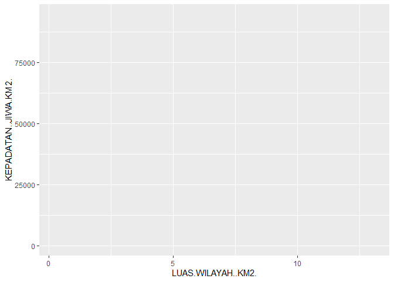<!-- -->

Scatter Plot Kepadatan Penduduk Jakarta dengan function layer

``` r
library(ggplot2)
#Membaca data csv dan dimasukkan ke variable penduduk.dki
penduduk.dki <- read.csv("https://storage.googleapis.com/dqlab-dataset/dkikepadatankelurahan2013.csv", sep=",")

#Menambahkan data dan aesthetic mapping
plot.dki <- ggplot(data=penduduk.dki, aes(x = LUAS.WILAYAH..KM2.,  y=KEPADATAN..JIWA.KM2.,  color=NAMA.KABUPATEN.KOTA))

#Menambahkan layer untuk menghasilkan grafik scatter plot
plot.dki + layer(geom = "point", stat = "identity", position = "identity")
```

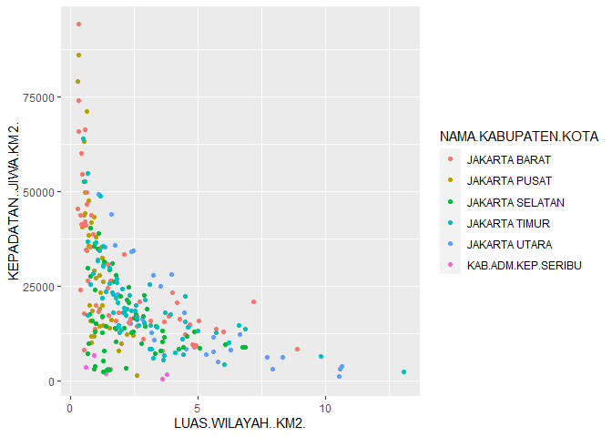<!-- -->

Scatter Plot Kepadatan Penduduk Jakarta dengan geom\_point

``` r
library(ggplot2)
#Membaca data csv dan dimasukkan ke variable penduduk.dki
penduduk.dki <- read.csv("https://storage.googleapis.com/dqlab-dataset/dkikepadatankelurahan2013.csv", sep=",")

#Menambahkan data dan aesthetic mapping
plot.dki <- ggplot(data=penduduk.dki, aes(x = LUAS.WILAYAH..KM2.,  y=KEPADATAN..JIWA.KM2.,  color=NAMA.KABUPATEN.KOTA))

#Menambahkan layer scatter plot dengan geom_point
plot.dki + geom_point()
```

<!-- -->

Menambahkan Judul dan Label

``` r
library(ggplot2)

#Membaca data csv dan dimasukkan ke variable penduduk.dki
penduduk.dki <- read.csv("https://storage.googleapis.com/dqlab-dataset/dkikepadatankelurahan2013.csv", sep=",")

#Menambahkan data dan aesthetic mapping
plot.dki <- ggplot(data=penduduk.dki, aes(x = LUAS.WILAYAH..KM2.,  y=KEPADATAN..JIWA.KM2.,  color=NAMA.KABUPATEN.KOTA))

#Menambahkan Layer dan labels
plot.dki + geom_point() + 
  theme(plot.title = element_text(hjust=0.5)) +
  labs(title =  "Luas Wilayah vs Kepadatan Penduduk DKI Jakarta", x = "Luas wilayah (km2)", y = "Kepadatan Jiwa per km2", color = "Nama Kabupaten/Kota")
```

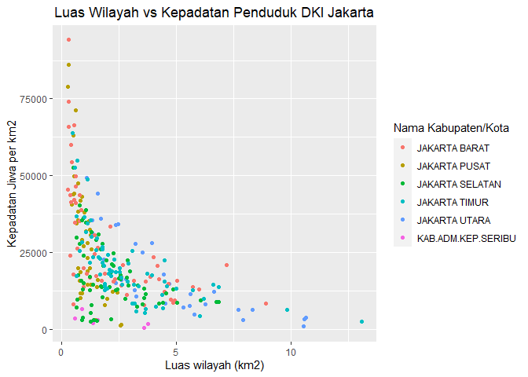<!-- -->

Layer geom\_histogram dan Lebar Interval

``` r
library(ggplot2)

#Membaca data csv dan dimasukkan ke variable penduduk.dki
penduduk.dki <- read.csv("https://storage.googleapis.com/dqlab-dataset/dkikepadatankelurahan2013.csv", sep=",")

#Menambahkan data dan aesthetic mapping
plot.dki <- ggplot(data=penduduk.dki, aes(x = KEPADATAN..JIWA.KM2.))
plot.dki + geom_histogram(binwidth=10000)
```

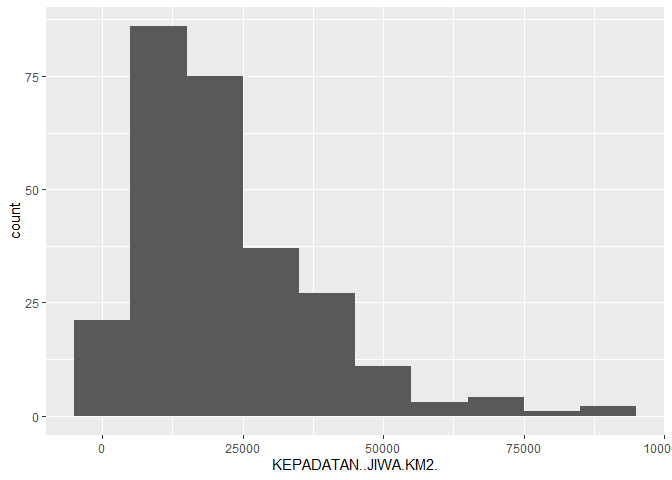<!-- -->

Penggunaaan aesthetic fill

``` r
library(ggplot2)

#Membaca data csv dan dimasukkan ke variable penduduk.dki
penduduk.dki <- read.csv("https://storage.googleapis.com/dqlab-dataset/dkikepadatankelurahan2013.csv", sep=",")

plot.dki <- ggplot(data=penduduk.dki, aes(x = KEPADATAN..JIWA.KM2., fill = NAMA.KABUPATEN.KOTA))

plot.dki + geom_histogram(binwidth = 10000)
```

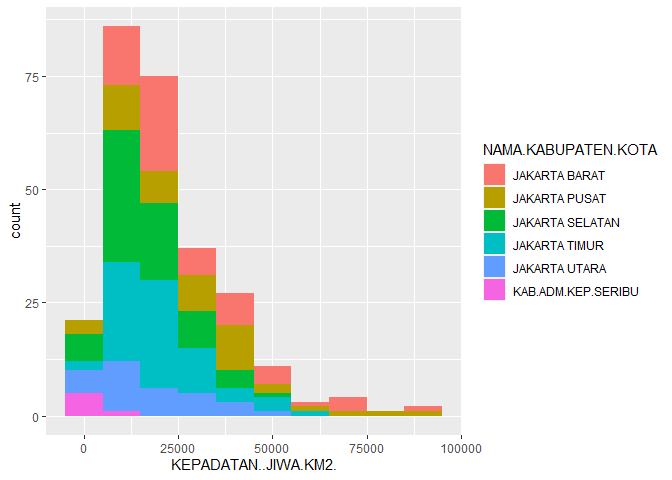<!-- -->

Membaca data inflasi

``` r
#Membaca data csv dan dimasukkan ke variable inflasi.indo.sing
inflasi.indo.sing <- read.csv("https://storage.googleapis.com/dqlab-dataset/inflasi.csv", sep=",")
inflasi.indo.sing
```

    ##       Bulan    Negara Inflasi
    ## 1  Jan-2017 Indonesia  0.0349
    ## 2  Feb-2017 Indonesia  0.0383
    ## 3  Mar-2017 Indonesia  0.0361
    ## 4  Apr-2017 Indonesia  0.0417
    ## 5  May-2017 Indonesia  0.0433
    ## 6  Jun-2017 Indonesia  0.0437
    ## 7  Jul-2017 Indonesia  0.0388
    ## 8  Aug-2017 Indonesia  0.0382
    ## 9  Sep-2017 Indonesia  0.0372
    ## 10 Oct-2017 Indonesia  0.0358
    ## 11 Jan-2017 Singapura  0.0250
    ## 12 Feb-2017 Singapura  0.0270
    ## 13 Mar-2017 Singapura  0.0240
    ## 14 Apr-2017 Singapura  0.0220
    ## 15 May-2017 Singapura  0.0190
    ## 16 Jun-2017 Singapura  0.0160
    ## 17 Jul-2017 Singapura  0.0170
    ## 18 Aug-2017 Singapura  0.0190
    ## 19 Sep-2017 Singapura  0.0220
    ## 20 Oct-2017 Singapura  0.0200

Error pada saat Plotting Line Chart

``` r
library(ggplot2)

#Membaca data csv dan dimasukkan ke variable inflasi.indo.sing
inflasi.indo.sing <- read.csv("https://storage.googleapis.com/dqlab-dataset/inflasi.csv", sep=",")

#Menambahkan data dan aesthetic mapping
plot.inflasi <- ggplot(data=inflasi.indo.sing, aes(x = Bulan,  y=Inflasi,  color=Negara))

#Menambahkan layer
plot.inflasi + geom_line()
```

    ## geom_path: Each group consists of only one observation. Do you need to adjust
    ## the group aesthetic?

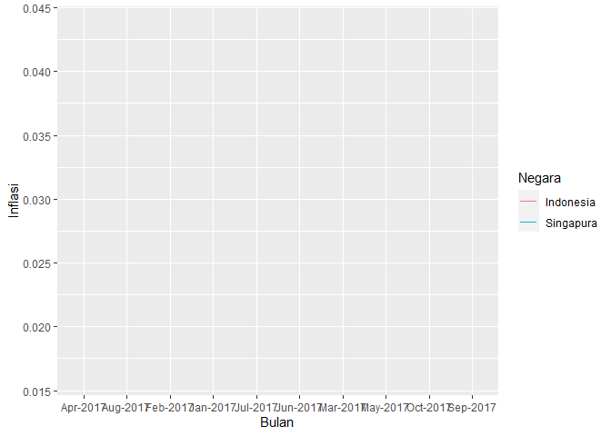<!-- -->

Menggunakan Pengelompokan Data (grouping)

``` r
library(ggplot2)

#Membaca data csv dan dimasukkan ke variable inflasi.indo.sing
inflasi.indo.sing <- read.csv("https://storage.googleapis.com/dqlab-dataset/inflasi.csv", sep=",")

#Menambahkan data dan aesthetic mapping
plot.inflasi <- ggplot(data=inflasi.indo.sing, aes(x = Bulan,  y=Inflasi,  color=Negara, group=Negara))

#Menambahkan Layer
plot.inflasi + geom_line()
```

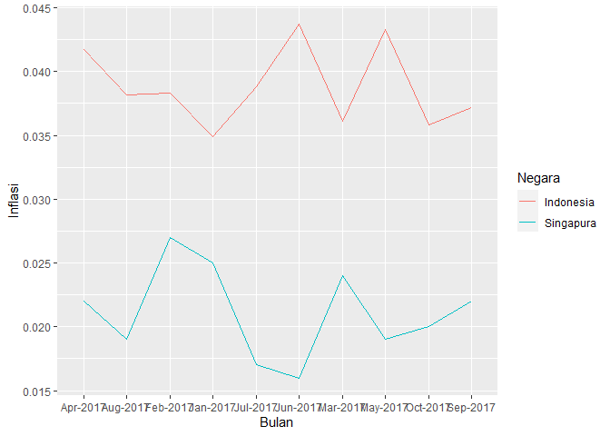<!-- -->

Memperbaiki Urutan Bulan dengan Factoring

``` r
library(ggplot2)
#Membaca data csv dan dimasukkan ke variable inflasi.indo.sing
inflasi.indo.sing <- read.csv("https://storage.googleapis.com/dqlab-dataset/inflasi.csv", sep=",")
inflasi.indo.sing$Bulan = factor(inflasi.indo.sing$Bulan, levels = c("Jan-2017", "Feb-2017", "Mar-2017", "Apr-2017", "May-2017", "Jun-2017", "Jul-2017", "Aug-2017", "Sep-2017", "Oct-2017"))

str(inflasi.indo.sing)
```

    ## 'data.frame':    20 obs. of  3 variables:
    ##  $ Bulan  : Factor w/ 10 levels "Jan-2017","Feb-2017",..: 1 2 3 4 5 6 7 8 9 10 ...
    ##  $ Negara : chr  "Indonesia" "Indonesia" "Indonesia" "Indonesia" ...
    ##  $ Inflasi: num  0.0349 0.0383 0.0361 0.0417 0.0433 0.0437 0.0388 0.0382 0.0372 0.0358 ...

Plotting Ulang dengan hasil Factoring

``` r
library(ggplot2)

#Membaca data csv dan dimasukkan ke variable inflasi.indo.sing
inflasi.indo.sing <- read.csv("https://storage.googleapis.com/dqlab-dataset/inflasi.csv", sep=",")

inflasi.indo.sing$Bulan = factor(inflasi.indo.sing$Bulan, 
                                 levels = c("Jan-2017", "Feb-2017", "Mar-2017", "Apr-2017", "May-2017", "Jun-2017", "Jul-2017", "Aug-2017", "Sep-2017", "Oct-2017"))

#Menambahkan data dan aesthetic mapping
plot.inflasi <- ggplot(data=inflasi.indo.sing, aes(x = Bulan,  y=Inflasi,  color=Negara, group=Negara))


#Menambahkan Layer dan labels
plot.inflasi + geom_line() + geom_text(aes(label=Inflasi),hjust=-0.2, vjust=-0.5)
```

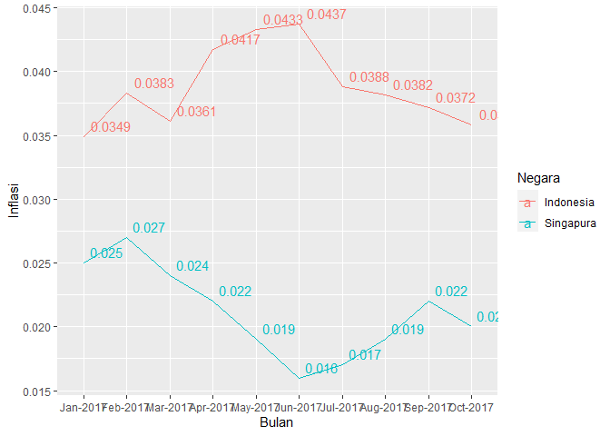<!-- -->

Menghasilkan Bar Chart Pertama

``` r
library(ggplot2)
#Membaca data csv dan dimasukkan ke variable penduduk.dki
penduduk.dki <- read.csv("https://storage.googleapis.com/dqlab-dataset/datakependudukandki-dqlab.csv", sep=",")
plot.dki <- ggplot(data=penduduk.dki, aes(x = NAMA.KABUPATEN.KOTA))
plot.dki + geom_bar()
```

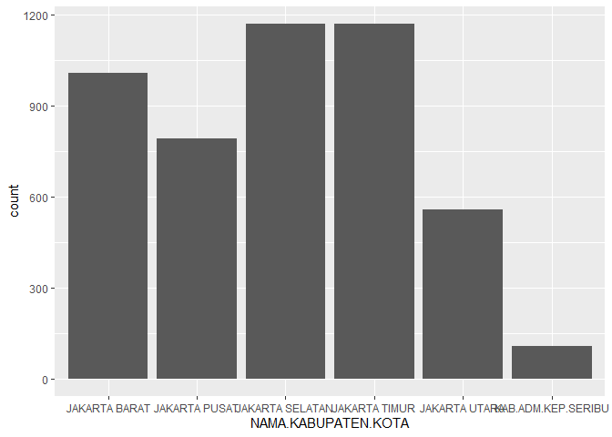<!-- -->

Aesthetic Y dan Stat Identity

``` r
library(ggplot2)

#Membaca data csv dan dimasukkan ke variable penduduk.dki
penduduk.dki <- read.csv("https://storage.googleapis.com/dqlab-dataset/datakependudukandki-dqlab.csv", sep=",")

#Menghasilkan bar chart

#Membuat plot
plot.dki <- ggplot(data=penduduk.dki, aes(x = NAMA.KABUPATEN.KOTA, y = JUMLAH))

#Menambahkan layer pada plot
plot.dki + geom_bar(stat="identity")
```

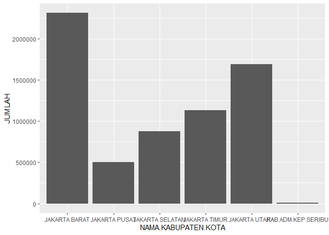<!-- -->

Aesthetic Fill dan Position Dodge

``` r
library(ggplot2)

#Membaca data csv dan dimasukkan ke variable penduduk.dki
penduduk.dki <- read.csv("https://storage.googleapis.com/dqlab-dataset/datakependudukandki-dqlab.csv", sep=",")

#Bagian plot
plot.dki <- ggplot(data=penduduk.dki, aes(x = NAMA.KABUPATEN.KOTA, y=JUMLAH, fill=JENIS.KELAMIN))

#Bagian penambahan layer
plot.dki + geom_bar(stat="identity", position="dodge")
```

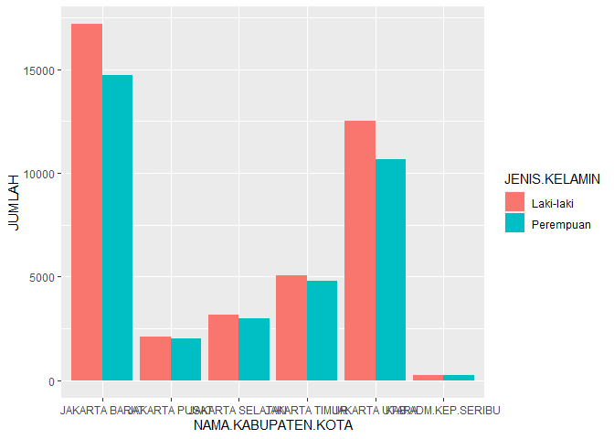<!-- -->

Fungsi Aggregate

``` r
library(ggplot2)

#Membaca data csv dan dimasukkan ke variable penduduk.dki
penduduk.dki <- read.csv("https://storage.googleapis.com/dqlab-dataset/datakependudukandki-dqlab.csv", sep=",")
#Melakukan agregasi
aggregate(x=list(JUMLAH=penduduk.dki$JUMLAH), FUN=sum, by = list(NAMA.KABUPATEN.KOTA=penduduk.dki$NAMA.KABUPATEN.KOTA, JENIS.KELAMIN=penduduk.dki$JENIS.KELAMIN))
```

    ##    NAMA.KABUPATEN.KOTA JENIS.KELAMIN  JUMLAH
    ## 1        JAKARTA BARAT     Laki-laki 1177351
    ## 2        JAKARTA PUSAT     Laki-laki  270490
    ## 3      JAKARTA SELATAN     Laki-laki  445152
    ## 4        JAKARTA TIMUR     Laki-laki  578471
    ## 5        JAKARTA UTARA     Laki-laki  861274
    ## 6   KAB.ADM.KEP.SERIBU     Laki-laki    4258
    ## 7        JAKARTA BARAT     Perempuan 1138830
    ## 8        JAKARTA PUSAT     Perempuan  229566
    ## 9      JAKARTA SELATAN     Perempuan  432985
    ## 10       JAKARTA TIMUR     Perempuan  557976
    ## 11       JAKARTA UTARA     Perempuan  834349
    ## 12  KAB.ADM.KEP.SERIBU     Perempuan    4050

“Merapikan” Tampilan Bar Chart

``` r
library(ggplot2)
#Membaca data csv dan dimasukkan ke variable penduduk.dki
penduduk.dki <- read.csv("https://storage.googleapis.com/dqlab-dataset/datakependudukandki-dqlab.csv", sep=",")
#Melakukan agregasi
p <- aggregate(x=list(JUMLAH=penduduk.dki$JUMLAH), FUN=sum, by = list(NAMA.KABUPATEN.KOTA=penduduk.dki$NAMA.KABUPATEN.KOTA, JENIS.KELAMIN=penduduk.dki$JENIS.KELAMIN))

#Plot grafik
plot.dki <- ggplot(data=p, aes(x = NAMA.KABUPATEN.KOTA, y=JUMLAH, fill=JENIS.KELAMIN, label = JUMLAH))
plot.dki <- plot.dki + geom_bar(stat="identity", position="dodge")  
plot.dki <- plot.dki + labs(title="Jumlah Penduduk DKI Jakarta Umur > 35 - Tahun 2013", x="Kabupaten / Kota", y="Jumlah Penduduk")
plot.dki <- plot.dki + theme(axis.text.x = element_text(angle=45,vjust = 0.5), plot.title = element_text(hjust=0.5))
plot.dki <- plot.dki + geom_text(position = position_dodge(1.2))
plot.dki
```

    ## Warning: position_dodge requires non-overlapping x intervals

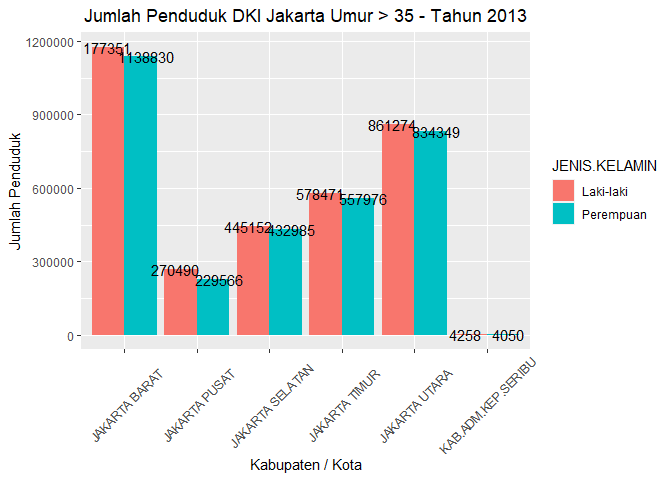<!-- -->

Pie Chart dengan Koordinat Polar

``` r
library(ggplot2)

#Membaca data csv dan dimasukkan ke variable penduduk.dki
penduduk.dki <- read.csv("https://storage.googleapis.com/dqlab-dataset/datakependudukandki-dqlab.csv", sep=",")
#Melakukan agregasi
p <- aggregate(x=list(JUMLAH=penduduk.dki$JUMLAH), FUN=sum, by = list(NAMA.KABUPATEN.KOTA=penduduk.dki$NAMA.KABUPATEN.KOTA))
#Plot grafik pie chart
plot.dki <- ggplot(data=p, aes(x="", y=JUMLAH, fill = NAMA.KABUPATEN.KOTA))

plot.dki <- plot.dki + geom_bar(width = 1, stat = "identity")
plot.dki <- plot.dki + coord_polar("y", start=0)
plot.dki
```

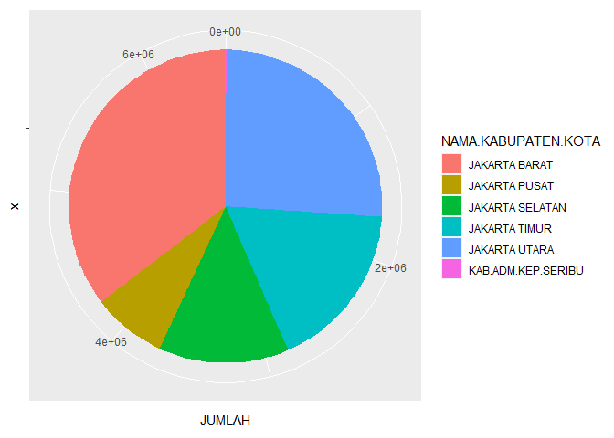<!-- -->

Dataset kependudukan yang telah kita gunakan pada bab-bab sebelumnya
sangat sulit digunakan dan perlu ditransformasikan terlebih dahulu. Geom
bar secara default hanya memerlukan aesthetic mapping x, karena secara
internal geom bar ini menggunakan stat = “count”. Jika ingin menghitung
agregasi sum, lebih baik kita gunakan variable baru yang menampung hasil
agregasi dengan function aggregate. Untuk membuat bar chart dengan
grouping yang bersisian, kita gunakan aesthetic mapping fill dan
positioning dodge. Bar chart dan pie chart adalah grafik dari ggplot2
yang memiliki karakteristik yang hampir sama, kecuali koordinat
polarnya.

Faceting pada Scatter Plot

``` r
library(ggplot2)

#Membaca data csv dan dimasukkan ke variable penduduk.dki
penduduk.dki <- read.csv("https://storage.googleapis.com/dqlab-dataset/dkikepadatankelurahan2013.csv", sep=",")

#Menambahkan data dan aesthetic mapping
plot.dki <- ggplot(data=penduduk.dki, aes(x = LUAS.WILAYAH..KM2.,  y=KEPADATAN..JIWA.KM2.,  color=NAMA.KABUPATEN.KOTA))

#Menambahkan layer
plot.dki <- plot.dki + layer(geom = "point", stat="identity", position = "identity")
plot.dki <- plot.dki + labs(x="Luas Wilayah (km2)", y="Kepadatan Jiwa (km2)", color="Kabupaten/Kota")
plot.dki + facet_wrap(~NAMA.KABUPATEN.KOTA, ncol=2)
```

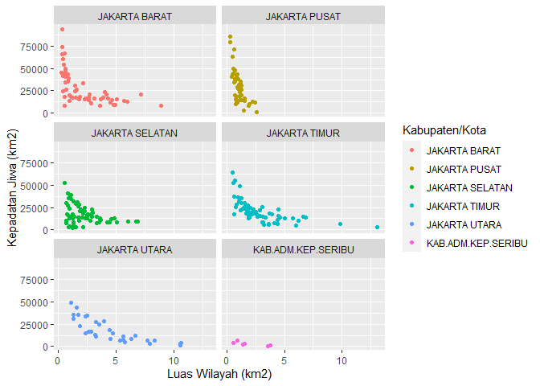<!-- -->

Faceting pada Histogram

``` r
library(ggplot2)

#Membaca data csv dan dimasukkan ke variable penduduk.dki
penduduk.dki <- read.csv("https://storage.googleapis.com/dqlab-dataset/dkikepadatankelurahan2013.csv", sep=",")

#Menambahkan data dan aesthetic mapping
plot.dki <- ggplot(data=penduduk.dki, aes(x=KEPADATAN..JIWA.KM2.,  fill=NAMA.KABUPATEN.KOTA))

#Menambahkan layer
plot.dki <- plot.dki + geom_histogram(binwidth=10000)
plot.dki <- plot.dki + labs(x="Kepadatan Jiwa (km2)", y="Jumlah Kelurahan", color="Kabupaten/Kota")
plot.dki + facet_wrap(~NAMA.KABUPATEN.KOTA, ncol=2)
```

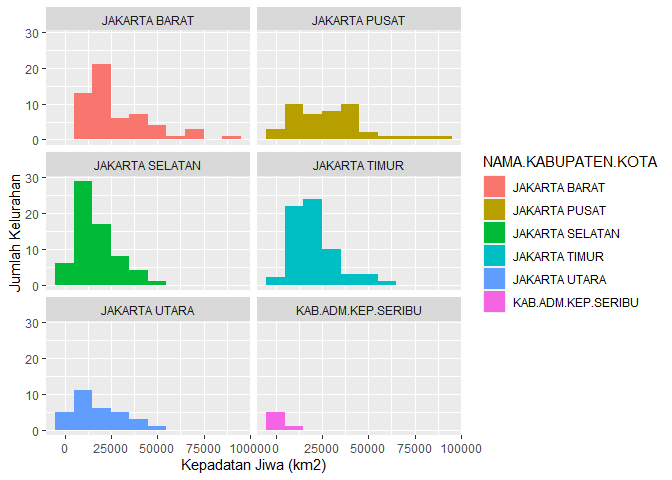<!-- -->
