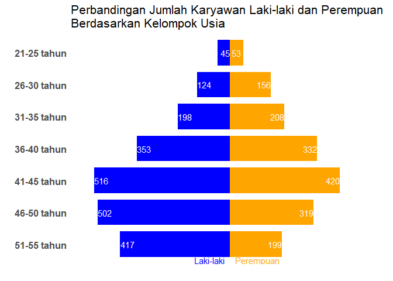
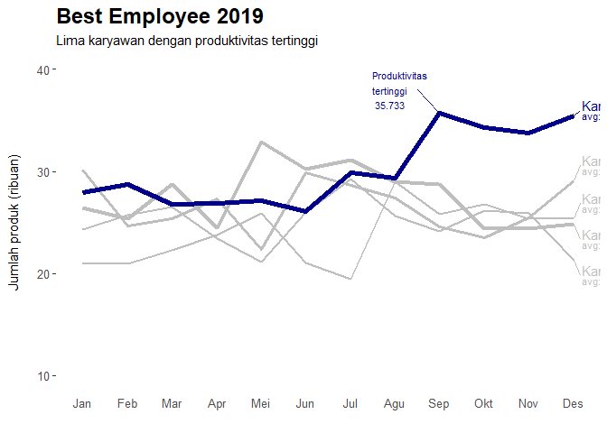

Fundamental Data Visualization using R
================

``` r
library(dplyr)
```

    ## 
    ## Attaching package: 'dplyr'

    ## The following objects are masked from 'package:stats':
    ## 
    ##     filter, lag

    ## The following objects are masked from 'package:base':
    ## 
    ##     intersect, setdiff, setequal, union

``` r
library(ggplot2)
tabel <- read.csv("https://storage.googleapis.com/dqlab-dataset/lo5_m01_mp01.csv") %>%
  mutate(Laki.laki = -Laki.laki) %>%
  arrange(desc(Kelompok.Usia))
tabel
```

    ##   Kelompok.Usia Laki.laki Perempuan
    ## 1   51-55 tahun      -417       199
    ## 2   46-50 tahun      -502       319
    ## 3   41-45 tahun      -516       420
    ## 4   36-40 tahun      -353       332
    ## 5   31-35 tahun      -198       208
    ## 6   26-30 tahun      -124       156
    ## 7   21-25 tahun       -45        53

Visualisasi - Part 1: ggplot

``` r
library(dplyr)
library(ggplot2)

tabel <- read.csv("https://storage.googleapis.com/dqlab-dataset/lo5_m01_mp01.csv") %>%
  mutate(Laki.laki = -Laki.laki) %>%
  arrange(desc(Kelompok.Usia))

plt <- ggplot(data = tabel,
              aes(x = factor(Kelompok.Usia,
                             levels = Kelompok.Usia))) +
  geom_bar(stat = "identity",
           width = 0.8,
           fill = "blue",
           aes(y = Laki.laki)) +
  geom_text(aes(x = Kelompok.Usia,
                y = Laki.laki + 27,
                label = abs(Laki.laki)),
            colour = "white") +
  geom_bar(stat = "identity",
           width = 0.8,
           fill = "orange",
           aes(y = Perempuan)) +
  geom_text(aes(x = Kelompok.Usia,
                y = Perempuan - 27,
                label = Perempuan),
            colour = "white") +
  ylim(-550, 550) +
  coord_flip() +
  annotate("text", x=0.5, y=-20, hjust=1,
           label="Laki-laki", colour="blue") +
  annotate("text", x=0.5, y=20, hjust=0,
           label="Perempuan", colour="orange") +
  labs(colour = "", x = "", y = "",
       title = "Perbandingan Jumlah Karyawan Laki-laki dan Perempuan\nBerdasarkan Kelompok Usia") +
  theme(axis.text = element_text(size = 12, face="bold"),
        axis.text.x = element_blank(),
        axis.ticks = element_blank(),
        plot.title = element_text(hjust = 0, size = 16),
        panel.background = element_rect(fill = "white"),
        legend.position = "bottom")

options(repr.plt.width = 10, repr.plt.height = 2)
plt
```

<!-- -->

``` r
tabel <- read.csv("https://storage.googleapis.com/dqlab-dataset/lo5_m01_mp02.csv") %>%
  mutate(Bulan = substr(Bulan, 1, 3),
         Karyawan.A = Karyawan.A/1000,
         Karyawan.B = Karyawan.B/1000,
         Karyawan.C = Karyawan.C/1000,
         Karyawan.D = Karyawan.D/1000,
         Karyawan.E = Karyawan.E/1000)
tabel
```

    ##    Bulan Karyawan.A Karyawan.B Karyawan.C Karyawan.D Karyawan.E
    ## 1    Jan     24.345     30.128     21.039     26.472     27.894
    ## 2    Feb     25.739     24.678     20.983     25.382     28.763
    ## 3    Mar     26.489     25.402     22.321     28.757     26.748
    ## 4    Apr     23.455     27.320     23.759     24.443     26.839
    ## 5    Mei     21.093     22.390     25.873     32.901     27.110
    ## 6    Jun     25.987     29.871     21.023     30.211     26.112
    ## 7    Jul     29.223     28.654     19.420     31.118     29.878
    ## 8    Agu     25.667     27.431     28.999     28.998     29.320
    ## 9    Sep     24.091     24.536     25.831     28.752     35.733
    ## 10   Okt     26.201     23.547     26.758     24.379     34.289
    ## 11   Nov     25.890     25.439     25.385     24.390     33.741
    ## 12   Des     21.345     29.087     25.380     24.879     35.478

Visualisasi - Part 2: ggplot

``` r
library(dplyr)
library(ggplot2)

tabel <- read.csv("https://storage.googleapis.com/dqlab-dataset/lo5_m01_mp02.csv") %>%
  mutate(Bulan = substr(Bulan, 1, 3),
         Karyawan.A = Karyawan.A/1000,
         Karyawan.B = Karyawan.B/1000,
         Karyawan.C = Karyawan.C/1000,
         Karyawan.D = Karyawan.D/1000,
         Karyawan.E = Karyawan.E/1000)

plt <- ggplot(data = tabel,
              aes(x = factor(Bulan, levels = Bulan))) +
  geom_line(aes(y = Karyawan.A, group=1,
                colour = "Karyawan A"),
            colour = "gray",
            size = 1) +
  geom_line(aes(y = Karyawan.B, group=1),
            colour = "gray",
            size = 1.25) +
  geom_line(aes(y = Karyawan.C, group=1),
            colour = "gray",
            size = 0.75) +
  geom_line(aes(y = Karyawan.D, group=1),
            colour = "gray",
            size = 1.5) +
  geom_line(aes(y = Karyawan.E, group=1),
            colour = "darkblue",
            size = 2) +
  ylim(10, 40) +
  # Produktivitas tertinggi
  annotate("segment", x=8.5, xend=9, y=38, yend=max(tabel$Karyawan.E),
           colour="darkblue", size=0.5) +
  annotate("text", x=7.5, 38, size=3, hjust=0, colour="darkblue",
           label=paste("Produktivitas\ntertinggi\n",
                       toString(max(tabel$Karyawan.E)))) +
  # Karyawan A
  annotate("segment", x=12, xend=12.15, colour="grey", size=0.5,
           y=tabel$Karyawan.A[12], yend=tabel$Karyawan.A[12]-1.5) +
  annotate("text", x=12.2, y=tabel$Karyawan.A[12]-1,
           hjust=0, colour="grey", label="Karyawan A") +
  annotate("text", x=12.2, y=tabel$Karyawan.A[12]-2,
           hjust=0, colour="grey", size=3,
           label=paste("avg:", toString(mean(tabel$Karyawan.A)))) +
  # Karyawan B
  annotate("segment", x=12, xend=12.15, colour="grey", size=0.5,
           y=tabel$Karyawan.B[12], yend=tabel$Karyawan.B[12]+1.5) +
  annotate("text", x=12.2, y=tabel$Karyawan.B[12]+2,
           hjust=0, colour="grey", label="Karyawan B") +
  annotate("text", x=12.2, y=tabel$Karyawan.B[12]+1,
           hjust=0, colour="grey", size=3,
           label=paste("avg:", toString(mean(tabel$Karyawan.B)))) +
  # Karyawan C
  annotate("segment", x=12, xend=12.15, colour="grey", size=0.5,
           y=tabel$Karyawan.C[12], yend=tabel$Karyawan.C[12]+1.5) +
  annotate("text", x=12.2, y=tabel$Karyawan.C[12]+2,
           hjust=0, colour="grey", label="Karyawan C") +
  annotate("text", x=12.2, y=tabel$Karyawan.C[12]+1,
           hjust=0, colour="grey", size=3,
           label=paste("avg:", toString(mean(tabel$Karyawan.C)))) +
  # Karyawan D
  annotate("segment", x=12, xend=12.15, colour="grey", size=0.5,
           y=tabel$Karyawan.D[12], yend=tabel$Karyawan.D[12]-1.5) +
  annotate("text", x=12.2, y=tabel$Karyawan.D[12]-1,
           hjust=0, colour="grey", label="Karyawan D") +
  annotate("text", x=12.2, y=tabel$Karyawan.D[12]-2,
           hjust=0, colour="grey", size=3,
           label=paste("avg:", toString(mean(tabel$Karyawan.D)))) +
  # Karyawan E
  annotate("segment", x=12, xend=12.15, colour="darkblue", size=0.5,
           y=tabel$Karyawan.E[12], yend=tabel$Karyawan.E[12]+0.5) +
  annotate("text", x=12.2, y=tabel$Karyawan.E[12]+1,
           hjust=0, colour="darkblue", label="Karyawan E") +
  annotate("text", x=12.2, y=tabel$Karyawan.E[12],
           hjust=0, colour="darkblue", size=3,
           label=paste("avg:", toString(mean(tabel$Karyawan.E)))) +
  labs(x = "", y = "Jumlah produk (ribuan)\n",
       title = "Best Employee 2019",
       subtitle = "Lima karyawan dengan produktivitas tertinggi") +
  theme(axis.text = element_text(size = 10),
        axis.ticks.x = element_blank(),
        plot.title = element_text(hjust = 0, size = 18, face="bold"),
        panel.background = element_rect(fill = "white"))
options(repr.plt.width = 10, repr.plt.height = 1)
plt
```

<!-- -->
