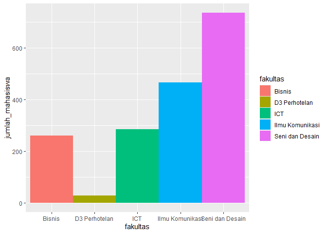
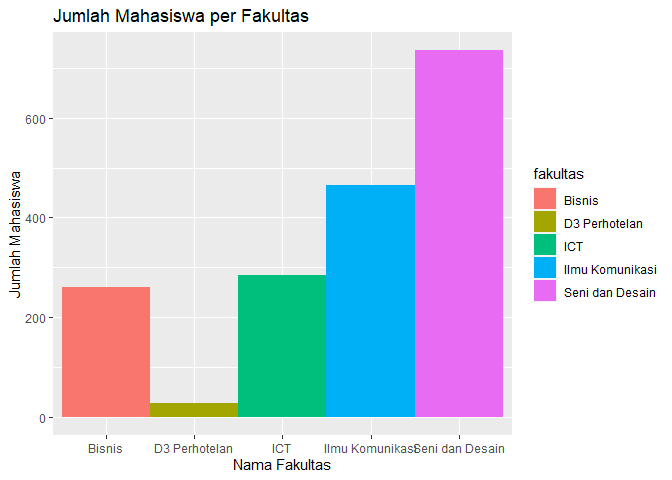
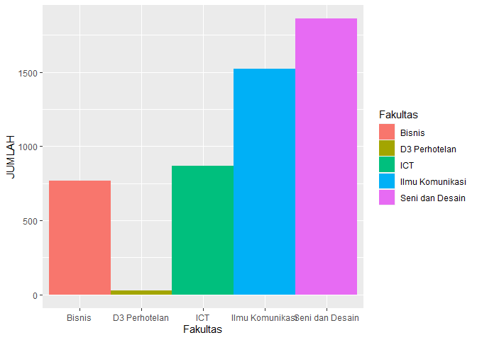
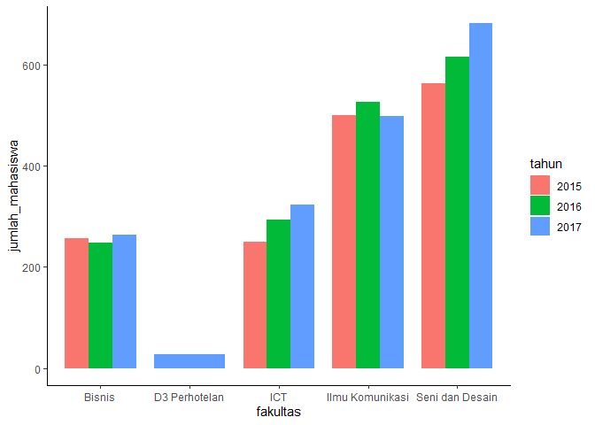
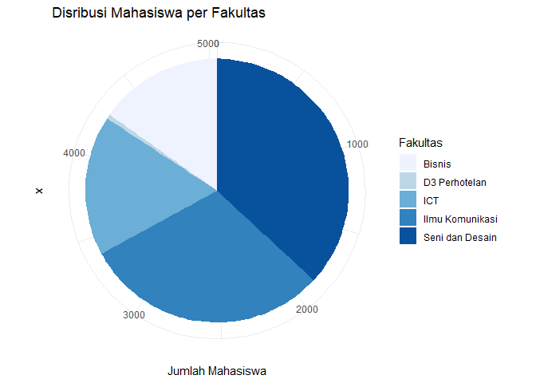
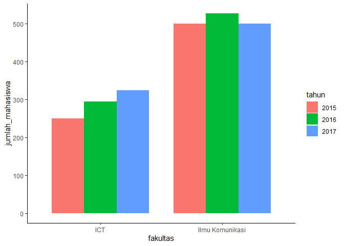

Introduction to Data Science with R
================

Code Pertama, Hello World\!

``` r
"Hello World"
```

    ## [1] "Hello World"

``` r
1+5
```

    ## [1] 6

Teks, Angka dan Rumus Perhitungan

``` r
9
```

    ## [1] 9

``` r
"Budi"
```

    ## [1] "Budi"

``` r
9*3
```

    ## [1] 27

Menampilkan dengan Fungsi Print

``` r
print("Hello World")
```

    ## [1] "Hello World"

``` r
print(3 + 4)
```

    ## [1] 7

Huruf Besar, Huruf Kecil dan Format Angka

``` r
01
```

    ## [1] 1

``` r
1
```

    ## [1] 1

``` r
"01-01-1980"
```

    ## [1] "01-01-1980"

``` r
"1-1-1980"
```

    ## [1] "1-1-1980"

``` r
"Budi"
```

    ## [1] "Budi"

``` r
"BUDI"
```

    ## [1] "BUDI"

Function

``` r
c(5:10)
```

    ## [1]  5  6  7  8  9 10

Variable

``` r
budi_berat_kg <- 68

santi_berat_kg <- 54.5

budi_berat_kg
```

    ## [1] 68

``` r
santi_berat_kg
```

    ## [1] 54.5

``` r
pi <- 3.14

pi
```

    ## [1] 3.14

Comment pada R

``` r
2 + 2 #Ini adalah baris komentar
```

    ## [1] 4

Vector

``` r
# Ini adalah contoh vector untuk angka numerik dengan 3 data c(4, 5, 6)
c(4,5,6)
```

    ## [1] 4 5 6

``` r
# Variable bernama angka dengan input berupa vector
angka <- c(4,5,6)
# Tampilkan isi variable angka dengan fungsi print
print(angka)
```

    ## [1] 4 5 6

Deretan Nilai dengan Operator :

``` r
angka1 <- c(1, 2, 3, 4, 5, 6, 7, 8, 9, 10)
print(angka1)
```

    ##  [1]  1  2  3  4  5  6  7  8  9 10

``` r
angka2 <- c(1:10)
print(angka2)
```

    ##  [1]  1  2  3  4  5  6  7  8  9 10

Vector dengan Isi Teks

``` r
# Variable nama_mahasiswa dengan input character
nama_mahasiswa <- c("Amira","Budi","Charlie")
print(nama_mahasiswa)
```

    ## [1] "Amira"   "Budi"    "Charlie"

Index dan Accessor pada Vector

``` r
# Buat vector variable bernama angka yang isinya 20 s/d 30
angka <- c(20:30)
print(angka)
```

    ##  [1] 20 21 22 23 24 25 26 27 28 29 30

``` r
# Tampilkan isi variable angka pada posisi ke 3
print(angka[3])
```

    ## [1] 22

``` r
# Tampilkan isi variable angka pada posisi ke 5
print(angka[[5]])
```

    ## [1] 24

``` r
# Tampilkan isi variable angka pada posisi ke 4 s/d 6
print(angka[4:6])
```

    ## [1] 23 24 25

``` r
# Buat vector teks dengan nama kode_prodi yang diisi sesuai petunjuk soal
kode_prodi <- c("DKV","ILKOM","ICT")

# Tampilkan isi indeks ketiga dari kode_prodi
print(kode_prodi[3])
```

    ## [1] "ICT"

Named Vector

``` r
#Membuat named vector dengan nama nilai
nilai <- c(statistik = 89, fisika = 95, ilmukomunikasi = 100)

#Menampilkan isi variable nilai
print(nilai)
```

    ##      statistik         fisika ilmukomunikasi 
    ##             89             95            100

``` r
#Menampilkan isi dengan nama fisika
print(nilai["fisika"])
```

    ## fisika 
    ##     95

``` r
#Buat variable profil sesuai permintaan soal
profil <- c(nama = "Budi", tempat_tinggal = "Jakarta", tingkat_pendidikan = "S1")
#Tampilkan variable profil
print(profil)
```

    ##               nama     tempat_tinggal tingkat_pendidikan 
    ##             "Budi"          "Jakarta"               "S1"

List

``` r
# List disimpan dalam variable dengan nama list_random
list_random <- list(2, "Budi", 4)

# Menampilkan isi list
list_random 
```

    ## [[1]]
    ## [1] 2
    ## 
    ## [[2]]
    ## [1] "Budi"
    ## 
    ## [[3]]
    ## [1] 4

``` r
# List disimpan dalam variable dengan nama dati2
dati2 <- list(nama = "Denpasar", propinsi = "Bali")

# Menampilkan isi list dati2
dati2 
```

    ## $nama
    ## [1] "Denpasar"
    ## 
    ## $propinsi
    ## [1] "Bali"

``` r
# Buat variable kota sesuai permintaan soal
kota <- list(nama_kota = "Makassar", propinsi = "Sulawesi Selatan", luas_km2 = 199.3)
# Tampilkan isi variable list kota
print(kota)
```

    ## $nama_kota
    ## [1] "Makassar"
    ## 
    ## $propinsi
    ## [1] "Sulawesi Selatan"
    ## 
    ## $luas_km2
    ## [1] 199.3

List Index

``` r
# Membentuk list dengan 2 angka dan 1 character
list_saya <- list(2, "Budi", 4)
# Menampilkan index kedua dengan aksesor kurung siku tunggal
list_saya[2]
```

    ## [[1]]
    ## [1] "Budi"

``` r
# Menampilkan index kedua dengan aksesor kurung siku ganda
list_saya[[2]]
```

    ## [1] "Budi"

``` r
# Menampilkan index kedua s/d ketiga
list_saya[2:3]
```

    ## [[1]]
    ## [1] "Budi"
    ## 
    ## [[2]]
    ## [1] 4

``` r
list_satu <- list(1,"Online",TRUE)
list_satu[1]
```

    ## [[1]]
    ## [1] 1

Data Frame

``` r
#Membuat dua variable vector
fakultas <- c("Bisnis", "D3 Perhotelan", "ICT", "Ilmu Komunikasi", "Seni dan Desain")
jumlah_mahasiswa <- c(260, 28, 284, 465, 735)

#Membuat data frame dari kedua vector di atas
info_mahasiswa <- data.frame(fakultas, jumlah_mahasiswa)

#Melihat isi data frame
info_mahasiswa
```

    ##          fakultas jumlah_mahasiswa
    ## 1          Bisnis              260
    ## 2   D3 Perhotelan               28
    ## 3             ICT              284
    ## 4 Ilmu Komunikasi              465
    ## 5 Seni dan Desain              735

``` r
#Buat vector baru sebagai representasi akreditasi
akreditasi <- c("A","A","B","A","A")
#Buat data frame dari ketiga vector di atas
info_mahasiswa <- data.frame(fakultas, jumlah_mahasiswa, akreditasi)
info_mahasiswa
```

    ##          fakultas jumlah_mahasiswa akreditasi
    ## 1          Bisnis              260          A
    ## 2   D3 Perhotelan               28          A
    ## 3             ICT              284          B
    ## 4 Ilmu Komunikasi              465          A
    ## 5 Seni dan Desain              735          A

Cara Akses Data Frame

``` r
#Membuat tiga variable vector
fakultas <- c("Bisnis", "D3 Perhotelan", "ICT", "Ilmu Komunikasi", "Seni dan Desain")
jumlah_mahasiswa <- c(260, 28, 284, 465, 735)
akreditasi <- c("A","A","B","A","A")

#Membuat data frame dari kedua vector di atas
info_mahasiswa <- data.frame(fakultas, jumlah_mahasiswa, akreditasi)

#Menampilkan kolom jumlah_mahasiswa
info_mahasiswa$jumlah_mahasiswa
```

    ## [1] 260  28 284 465 735

``` r
#Menampilkan kolom fakultas
info_mahasiswa$fakultas
```

    ## [1] "Bisnis"          "D3 Perhotelan"   "ICT"             "Ilmu Komunikasi"
    ## [5] "Seni dan Desain"

Package ggplot2

``` r
fakultas <- c("Bisnis", "D3 Perhotelan", "ICT", "Ilmu Komunikasi", "Seni dan Desain")
jumlah_mahasiswa <- c(260, 28, 284, 465, 735)
akreditasi <- c("A","A","B","A","A")

info_mahasiswa <- data.frame(fakultas, jumlah_mahasiswa, akreditasi)
info_mahasiswa
```

    ##          fakultas jumlah_mahasiswa akreditasi
    ## 1          Bisnis              260          A
    ## 2   D3 Perhotelan               28          A
    ## 3             ICT              284          B
    ## 4 Ilmu Komunikasi              465          A
    ## 5 Seni dan Desain              735          A

``` r
#Menggunakan package ggplot2
library("ggplot2")
#Membuat kanvas
gambar <- ggplot(info_mahasiswa, aes(x=fakultas, y=jumlah_mahasiswa, fill=fakultas))
gambar <- gambar + geom_bar(width=1, stat="identity")
gambar
```

<!-- -->
Membuat Grafik Sebaran Mahasiswa (1)

``` r
#Membuat dua vector
fakultas <- c("Bisnis", "D3 Perhotelan", "ICT", "Ilmu Komunikasi", "Seni dan Desain")
jumlah_mahasiswa <- c(260, 28, 284, 465, 735)
akreditasi <- c("A","A","B","A","A")

#Buat data frame dari ketiga vector di atas
info_mahasiswa <- data.frame(fakultas, jumlah_mahasiswa, akreditasi)
info_mahasiswa
```

    ##          fakultas jumlah_mahasiswa akreditasi
    ## 1          Bisnis              260          A
    ## 2   D3 Perhotelan               28          A
    ## 3             ICT              284          B
    ## 4 Ilmu Komunikasi              465          A
    ## 5 Seni dan Desain              735          A

``` r
#Menggunakan package ggplot2
library(ggplot2)

#Membuat kanvas
gambar <- ggplot(info_mahasiswa, aes(x=fakultas, y=jumlah_mahasiswa, fill=fakultas))

#Menambahkan objek bar chart, simpan kembali sebagai variable gambar
gambar <- gambar + geom_bar(width=1, stat="identity")

#Menambahkan judul grafik
gambar <- gambar + ggtitle("Jumlah Mahasiswa per Fakultas")

#Menambahkan caption pada sumbu x
gambar <- gambar + xlab("Nama Fakultas")

#Menambahkan caption pada sumbu y
gambar <- gambar + ylab("Jumlah Mahasiswa")

#Menggambar grafik
gambar
```

<!-- -->
Membaca File Excel

``` r
#Menggunakan package ggplot2
library(ggplot2)
#Menggunakan package openxlsx
library(openxlsx)
```

    ## Warning: package 'openxlsx' was built under R version 4.0.5

``` r
#Membaca file mahasiswa.xlsx
mahasiswa <- read.xlsx("https://storage.googleapis.com/dqlab-dataset/mahasiswa.xlsx",sheet = "Sheet 1")

#Menampilkan data
print(mahasiswa)
```

    ##    ANGKATAN        Fakultas                          Prodi  Kode JUMLAH
    ## 1      2015          Bisnis                      Akuntansi  AKUN     88
    ## 2      2016          Bisnis                      Akuntansi  AKUN     85
    ## 3      2017          Bisnis                      Akuntansi  AKUN    103
    ## 4      2016 Seni dan Desain                        Arsitek    AR     28
    ## 5      2017 Seni dan Desain                        Arsitek    AR     45
    ## 6      2015 Seni dan Desain       Desain Komunikasi Visual   DKV    279
    ## 7      2016 Seni dan Desain       Desain Komunikasi Visual   DKV    314
    ## 8      2017 Seni dan Desain       Desain Komunikasi Visual   DKV    337
    ## 9      2015 Seni dan Desain              Film dan Televisi   FTV    284
    ## 10     2016 Seni dan Desain              Film dan Televisi   FTV    274
    ## 11     2017 Seni dan Desain              Film dan Televisi   FTV    300
    ## 12     2015 Ilmu Komunikasi                Ilmu Komunikasi ILKOM    499
    ## 13     2016 Ilmu Komunikasi                Ilmu Komunikasi ILKOM    275
    ## 14     2017 Ilmu Komunikasi                Ilmu Komunikasi ILKOM    313
    ## 15     2015 Ilmu Komunikasi                    Jurnalistik    JR      1
    ## 16     2016 Ilmu Komunikasi                    Jurnalistik    JR    251
    ## 17     2017 Ilmu Komunikasi                    Jurnalistik    JR    186
    ## 18     2015          Bisnis                      Manajemen   MAN    169
    ## 19     2016          Bisnis                      Manajemen   MAN    163
    ## 20     2017          Bisnis                      Manajemen   MAN    160
    ## 21     2017   D3 Perhotelan                     Perhotelan   HTL     28
    ## 22     2015             ICT               Sistem Informasi    SI    104
    ## 23     2016             ICT               Sistem Informasi    SI     95
    ## 24     2017             ICT               Sistem Informasi    SI    113
    ## 25     2015             ICT                Sistem Komputer    SK     20
    ## 26     2016             ICT                Sistem Komputer    SK     20
    ## 27     2017             ICT                Sistem Komputer    SK     18
    ## 28     2016             ICT                 Teknik Elektro    TE      4
    ## 29     2017             ICT                 Teknik Elektro    TE      7
    ## 30     2016             ICT                  Teknik Fisika    TF      7
    ## 31     2017             ICT                  Teknik Fisika    TF     16
    ## 32     2015             ICT             Teknik Informatika    TI    125
    ## 33     2016             ICT             Teknik Informatika    TI    168
    ## 34     2017             ICT             Teknik Informatika    TI    164
    ## 35     2017             ICT Teknik Informatika Dual Degree   TID      6

``` r
#Menampilkan kolom Prodi
print(mahasiswa$Prodi)
```

    ##  [1] "Akuntansi"                      "Akuntansi"                     
    ##  [3] "Akuntansi"                      "Arsitek"                       
    ##  [5] "Arsitek"                        "Desain Komunikasi Visual"      
    ##  [7] "Desain Komunikasi Visual"       "Desain Komunikasi Visual"      
    ##  [9] "Film dan Televisi"              "Film dan Televisi"             
    ## [11] "Film dan Televisi"              "Ilmu Komunikasi"               
    ## [13] "Ilmu Komunikasi"                "Ilmu Komunikasi"               
    ## [15] "Jurnalistik"                    "Jurnalistik"                   
    ## [17] "Jurnalistik"                    "Manajemen"                     
    ## [19] "Manajemen"                      "Manajemen"                     
    ## [21] "Perhotelan"                     "Sistem Informasi"              
    ## [23] "Sistem Informasi"               "Sistem Informasi"              
    ## [25] "Sistem Komputer"                "Sistem Komputer"               
    ## [27] "Sistem Komputer"                "Teknik Elektro"                
    ## [29] "Teknik Elektro"                 "Teknik Fisika"                 
    ## [31] "Teknik Fisika"                  "Teknik Informatika"            
    ## [33] "Teknik Informatika"             "Teknik Informatika"            
    ## [35] "Teknik Informatika Dual Degree"

Membuat Grafik Sebaran Mahasiswa (2)

``` r
library(ggplot2)
#Menggunakan package openxlsx
library(openxlsx)

#Membaca file mahasiswa.xlsx
mahasiswa <- read.xlsx("https://storage.googleapis.com/dqlab-dataset/mahasiswa.xlsx",sheet = "Sheet 1")

#Membuat kanvas
gambar <- ggplot(mahasiswa, aes(x=Fakultas, y=JUMLAH, fill=Fakultas))

#Menambahkan objek bar chart, simpan kembali sebagai variable gambar
gambar <- gambar + geom_bar(width=1, stat="identity")

#Menggambar grafik
gambar
```

<!-- -->
Trend Jumlah Mahasiswa dari Tahun ke Tahun

``` r
library(ggplot2)
#Menggunakan package openxlsx
library(openxlsx)

#Membaca file mahasiswa.xlsx
mahasiswa <- read.xlsx("https://storage.googleapis.com/dqlab-dataset/mahasiswa.xlsx",sheet = "Sheet 1")

#Menghitung Jumlah Data by Fakultas
summarybyfakultas <- aggregate(x=mahasiswa$JUMLAH, by=list(Kategori=mahasiswa$Fakultas, Tahun=mahasiswa$ANGKATAN), FUN=sum)
summarybyfakultas <- setNames(summarybyfakultas, c("fakultas","tahun", "jumlah_mahasiswa"))
summarybyfakultas
```

    ##           fakultas tahun jumlah_mahasiswa
    ## 1           Bisnis  2015              257
    ## 2              ICT  2015              249
    ## 3  Ilmu Komunikasi  2015              500
    ## 4  Seni dan Desain  2015              563
    ## 5           Bisnis  2016              248
    ## 6              ICT  2016              294
    ## 7  Ilmu Komunikasi  2016              526
    ## 8  Seni dan Desain  2016              616
    ## 9           Bisnis  2017              263
    ## 10   D3 Perhotelan  2017               28
    ## 11             ICT  2017              324
    ## 12 Ilmu Komunikasi  2017              499
    ## 13 Seni dan Desain  2017              682

``` r
summarybyfakultas$tahun = as.factor(summarybyfakultas$tahun)

ggplot(summarybyfakultas, aes(x=fakultas, y=jumlah_mahasiswa)) + 
  geom_bar(stat = "identity", aes(fill = tahun), width=0.8, position = position_dodge(width=0.8)) + 
  theme_classic() 
```

<!-- -->
Pie Chart

``` r
library(ggplot2)
library(openxlsx)
#Membaca file mahasiswa.xlsx
mahasiswa <- read.xlsx("https://storage.googleapis.com/dqlab-dataset/mahasiswa.xlsx",sheet = "Sheet 1")

#Menghitung Jumlah Data by Fakultas
summarybyfakultas <- aggregate(x=mahasiswa$JUMLAH, by=list(Kategori=mahasiswa$Fakultas), FUN=sum)
summarybyfakultas <- setNames(summarybyfakultas, c("fakultas","jumlah_mahasiswa"))

piechart<- ggplot(summarybyfakultas, aes(x="", y=jumlah_mahasiswa, fill=fakultas))+ geom_bar(width = 1, stat = "identity")
piechart <- piechart + coord_polar("y", start=0)
piechart <- piechart + ggtitle("Disribusi Mahasiswa per Fakultas")
piechart <- piechart + scale_fill_brewer(palette="Blues")+ theme_minimal()
piechart <- piechart + guides(fill=guide_legend(title="Fakultas"))
piechart <- piechart + ylab("Jumlah Mahasiswa") 
piechart
```

<!-- -->
Filtering

``` r
library("ggplot2")
library("openxlsx")

#Membaca file mahasiswa.xlsx
mahasiswa <- read.xlsx("https://storage.googleapis.com/dqlab-dataset/mahasiswa.xlsx",sheet = "Sheet 1")

#Menghitung Jumlah Data by Fakultas
summarybyfakultas <- aggregate(x=mahasiswa$JUMLAH, by=list(Kategori=mahasiswa$Fakultas, Tahun=mahasiswa$ANGKATAN), FUN=sum)
summarybyfakultas <- setNames(summarybyfakultas, c("fakultas","tahun", "jumlah_mahasiswa"))
summarybyfakultas
```

    ##           fakultas tahun jumlah_mahasiswa
    ## 1           Bisnis  2015              257
    ## 2              ICT  2015              249
    ## 3  Ilmu Komunikasi  2015              500
    ## 4  Seni dan Desain  2015              563
    ## 5           Bisnis  2016              248
    ## 6              ICT  2016              294
    ## 7  Ilmu Komunikasi  2016              526
    ## 8  Seni dan Desain  2016              616
    ## 9           Bisnis  2017              263
    ## 10   D3 Perhotelan  2017               28
    ## 11             ICT  2017              324
    ## 12 Ilmu Komunikasi  2017              499
    ## 13 Seni dan Desain  2017              682

``` r
summarybyfakultas$tahun = as.factor(summarybyfakultas$tahun)
summarybyfakultas[summarybyfakultas$fakultas %in% c("ICT", "Ilmu Komunikasi"),]
```

    ##           fakultas tahun jumlah_mahasiswa
    ## 2              ICT  2015              249
    ## 3  Ilmu Komunikasi  2015              500
    ## 6              ICT  2016              294
    ## 7  Ilmu Komunikasi  2016              526
    ## 11             ICT  2017              324
    ## 12 Ilmu Komunikasi  2017              499

``` r
ggplot(summarybyfakultas[summarybyfakultas$fakultas %in% c("ICT", "Ilmu Komunikasi"),], aes(x=fakultas, y=jumlah_mahasiswa)) + 
  geom_bar(stat = "identity", aes(fill = tahun), width=0.8, position = position_dodge(width=0.8)) + 
  theme_classic() 
```

<!-- -->
