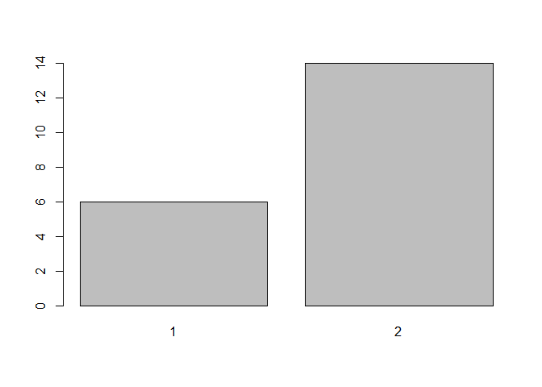
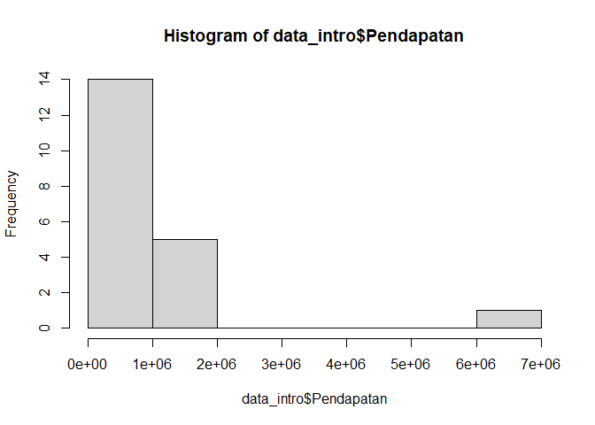
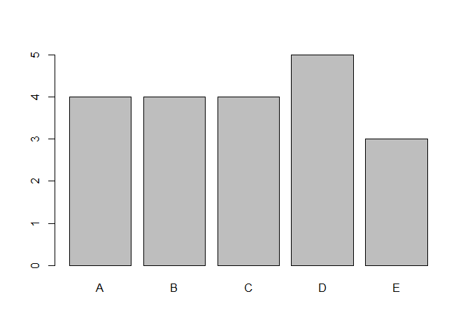
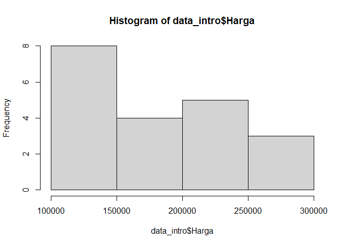
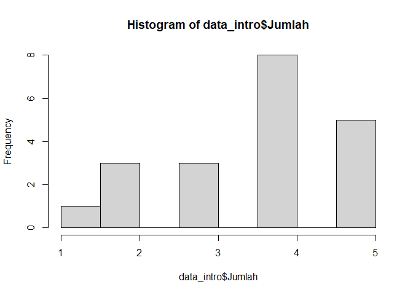
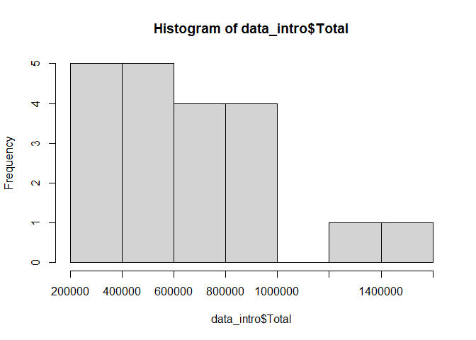
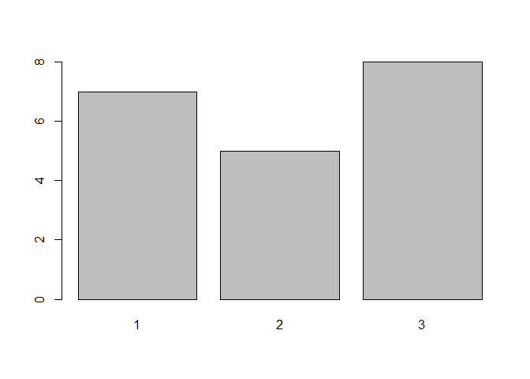
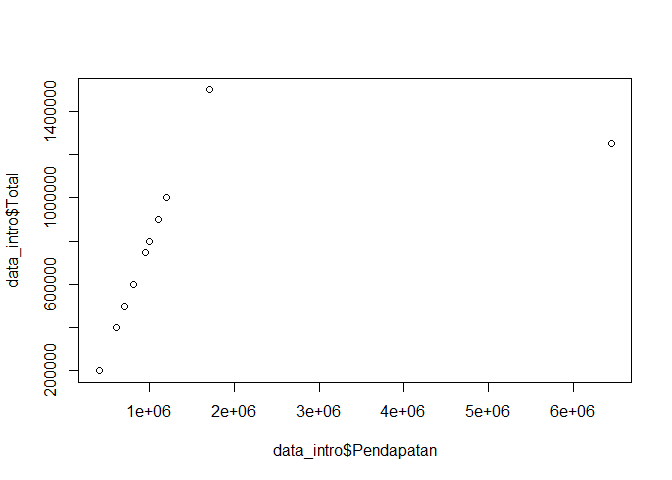
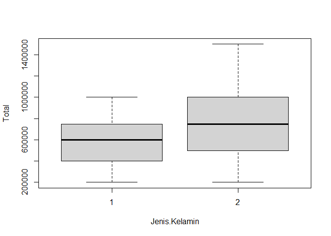

Statistics using R for Data Science
================

Membaca Dataset dengan read.csv

``` r
data_intro <- read.csv("https://storage.googleapis.com/dqlab-dataset/data_intro.csv",sep=";") #Membaca dataset dengan read.csv dan dimasukkan ke variable data_intro
data_intro
```

    ##    ID.Pelanggan    Nama Jenis.Kelamin Pendapatan Produk  Harga Jumlah   Total
    ## 1             1    Arif             1     600000      A 100000      4  400000
    ## 2             2    Dian             2    1200000      D 250000      4 1000000
    ## 3             3   Dinda             2     950000      D 250000      3  750000
    ## 4             4   Fajar             1     400000      A 100000      2  200000
    ## 5             5     Ika             2    1200000      D 250000      4 1000000
    ## 6             6   Ilham             1     800000      B 150000      4  600000
    ## 7             7   Indra             1     950000      B 150000      5  750000
    ## 8             8 Kartika             2    1100000      E 300000      3  900000
    ## 9             9 Lestari             2     800000      E 300000      2  600000
    ## 10           10     Lia             2    1700000      E 300000      5 1500000
    ## 11           11   Maria             2     600000      A 100000      4  400000
    ## 12           12    Maya             2     950000      B 150000      5  750000
    ## 13           13    Mila             2     400000      C 200000      1  200000
    ## 14           14   Nurul             2    6450000      D 250000      5 1250000
    ## 15           15   Retno             2    1000000      C 200000      4  800000
    ## 16           16    Rini             2     800000      B 150000      4  600000
    ## 17           17   Rizki             1    1200000      C 200000      5 1000000
    ## 18           18    Sari             2     700000      D 250000      2  500000
    ## 19           19    Tyas             2     600000      A 100000      4  400000
    ## 20           20   Wahyu             1     800000      C 200000      3  600000
    ##    Tingkat.Kepuasan
    ## 1                 2
    ## 2                 2
    ## 3                 3
    ## 4                 3
    ## 5                 2
    ## 6                 3
    ## 7                 1
    ## 8                 3
    ## 9                 1
    ## 10                1
    ## 11                3
    ## 12                3
    ## 13                2
    ## 14                1
    ## 15                2
    ## 16                1
    ## 17                3
    ## 18                1
    ## 19                3
    ## 20                1

Melihat Tipe Data dengan Str

``` r
#Membaca dataset dengan read.csv dan dimasukkan ke variable data_intro
data_intro <- read.csv("https://storage.googleapis.com/dqlab-dataset/data_intro.csv",sep=";")
str(data_intro)
```

    ## 'data.frame':    20 obs. of  9 variables:
    ##  $ ID.Pelanggan    : int  1 2 3 4 5 6 7 8 9 10 ...
    ##  $ Nama            : chr  "Arif" "Dian" "Dinda" "Fajar" ...
    ##  $ Jenis.Kelamin   : int  1 2 2 1 2 1 1 2 2 2 ...
    ##  $ Pendapatan      : int  600000 1200000 950000 400000 1200000 800000 950000 1100000 800000 1700000 ...
    ##  $ Produk          : chr  "A" "D" "D" "A" ...
    ##  $ Harga           : int  100000 250000 250000 100000 250000 150000 150000 300000 300000 300000 ...
    ##  $ Jumlah          : int  4 4 3 2 4 4 5 3 2 5 ...
    ##  $ Total           : int  400000 1000000 750000 200000 1000000 600000 750000 900000 600000 1500000 ...
    ##  $ Tingkat.Kepuasan: int  2 2 3 3 2 3 1 3 1 1 ...

Merubah Tipe Data Kolom ID.Pelanggan menjadi Character

``` r
## mengubah data menjadi karakter karena tidak dilakukan analisis statistik pada variabel ID Pelanggan dan nama
data_intro$ID.Pelanggan <-as.character(data_intro$ID.Pelanggan)
data_intro$Nama <-as.character(data_intro$Nama)
## melihat apakah sudah berhasil dalam mengubah variabel tersebut
str(data_intro$ID.Pelanggan)
```

    ##  chr [1:20] "1" "2" "3" "4" "5" "6" "7" "8" "9" "10" "11" "12" "13" "14" ...

``` r
str(data_intro$Nama)
```

    ##  chr [1:20] "Arif" "Dian" "Dinda" "Fajar" "Ika" "Ilham" "Indra" "Kartika" ...

Merubah Sejumlah Kolom menjadi Data Kategorik (Factor)

``` r
## Mengubah data menjadi factor untuk membedakan data kualitatif dengan menggunakan functon as.factor
data_intro$Jenis.Kelamin <- as.factor(data_intro$Jenis.Kelamin)
data_intro$Produk <- as.factor(data_intro$Produk)
data_intro$Tingkat.Kepuasan <- as.factor(data_intro$Tingkat.Kepuasan)
## Melihat apakah sudah berhasil dalam mengubah variabel tersebut dengan menggunakan function str
str(data_intro$Jenis.Kelamin)
```

    ##  Factor w/ 2 levels "1","2": 1 2 2 1 2 1 1 2 2 2 ...

``` r
str(data_intro$Produk)
```

    ##  Factor w/ 5 levels "A","B","C","D",..: 1 4 4 1 4 2 2 5 5 5 ...

``` r
str(data_intro$Tingkat.Kepuasan)
```

    ##  Factor w/ 3 levels "1","2","3": 2 2 3 3 2 3 1 3 1 1 ...

Skala Pengukuran Data

``` r
## melihat data/ pemanggilan data
data_intro
```

    ##    ID.Pelanggan    Nama Jenis.Kelamin Pendapatan Produk  Harga Jumlah   Total
    ## 1             1    Arif             1     600000      A 100000      4  400000
    ## 2             2    Dian             2    1200000      D 250000      4 1000000
    ## 3             3   Dinda             2     950000      D 250000      3  750000
    ## 4             4   Fajar             1     400000      A 100000      2  200000
    ## 5             5     Ika             2    1200000      D 250000      4 1000000
    ## 6             6   Ilham             1     800000      B 150000      4  600000
    ## 7             7   Indra             1     950000      B 150000      5  750000
    ## 8             8 Kartika             2    1100000      E 300000      3  900000
    ## 9             9 Lestari             2     800000      E 300000      2  600000
    ## 10           10     Lia             2    1700000      E 300000      5 1500000
    ## 11           11   Maria             2     600000      A 100000      4  400000
    ## 12           12    Maya             2     950000      B 150000      5  750000
    ## 13           13    Mila             2     400000      C 200000      1  200000
    ## 14           14   Nurul             2    6450000      D 250000      5 1250000
    ## 15           15   Retno             2    1000000      C 200000      4  800000
    ## 16           16    Rini             2     800000      B 150000      4  600000
    ## 17           17   Rizki             1    1200000      C 200000      5 1000000
    ## 18           18    Sari             2     700000      D 250000      2  500000
    ## 19           19    Tyas             2     600000      A 100000      4  400000
    ## 20           20   Wahyu             1     800000      C 200000      3  600000
    ##    Tingkat.Kepuasan
    ## 1                 2
    ## 2                 2
    ## 3                 3
    ## 4                 3
    ## 5                 2
    ## 6                 3
    ## 7                 1
    ## 8                 3
    ## 9                 1
    ## 10                1
    ## 11                3
    ## 12                3
    ## 13                2
    ## 14                1
    ## 15                2
    ## 16                1
    ## 17                3
    ## 18                1
    ## 19                3
    ## 20                1

``` r
## melihat tipe data
str(data_intro)
```

    ## 'data.frame':    20 obs. of  9 variables:
    ##  $ ID.Pelanggan    : chr  "1" "2" "3" "4" ...
    ##  $ Nama            : chr  "Arif" "Dian" "Dinda" "Fajar" ...
    ##  $ Jenis.Kelamin   : Factor w/ 2 levels "1","2": 1 2 2 1 2 1 1 2 2 2 ...
    ##  $ Pendapatan      : int  600000 1200000 950000 400000 1200000 800000 950000 1100000 800000 1700000 ...
    ##  $ Produk          : Factor w/ 5 levels "A","B","C","D",..: 1 4 4 1 4 2 2 5 5 5 ...
    ##  $ Harga           : int  100000 250000 250000 100000 250000 150000 150000 300000 300000 300000 ...
    ##  $ Jumlah          : int  4 4 3 2 4 4 5 3 2 5 ...
    ##  $ Total           : int  400000 1000000 750000 200000 1000000 600000 750000 900000 600000 1500000 ...
    ##  $ Tingkat.Kepuasan: Factor w/ 3 levels "1","2","3": 2 2 3 3 2 3 1 3 1 1 ...

Estimasi Nilai Statistik Modus

``` r
library(pracma)
```

    ## Warning: package 'pracma' was built under R version 4.0.5

``` r
## carilah modus untuk kolom Produk pada variable data_intro
Mode(data_intro$Produk)
```

    ## [1] "D"

``` r
## carilah modus untuk kolom Tingkat.Kepuasan pada variable data_intro
Mode(data_intro$Tingkat.Kepuasan)
```

    ## [1] "3"

Estimasi Nilai Statistik Median

``` r
## carilah median untuk kolom Pendapatan dari variable data_intro
median(data_intro$Pendapatan)
```

    ## [1] 875000

``` r
## carilah median untuk  kolom Harga dari variable data_intro
median(data_intro$Harga)
```

    ## [1] 2e+05

``` r
## carilah median untuk kolom Jumlah dari variable data_intro
median(data_intro$Jumlah)
```

    ## [1] 4

``` r
## carilah median untuk  kolom Total dari variable data_intro
median(data_intro$Total)
```

    ## [1] 675000

Estimasi Nilai Statistik Rata-Rata

``` r
## carilah mean untuk kolom Pendapatan pada variable data_intro
mean(data_intro$Pendapatan)
```

    ## [1] 1160000

``` r
## carilah mean untuk kolom Harga pada variable data_intro
mean(data_intro$Harga)
```

    ## [1] 197500

``` r
## carilah mean untuk kolom Jumlah pada variable data_intro
mean(data_intro$Jumlah)
```

    ## [1] 3.65

``` r
## carilah mean untuk kolom Total pada variable data_intro
mean(data_intro$Total)
```

    ## [1] 710000

Estimasi Nilai Sebaran Data Range

``` r
## carilah range untuk kolom Pendapatan pada variable data_intro
max(data_intro$Pendapatan)-min(data_intro$Pendapatan)
```

    ## [1] 6050000

Estimasi Nilai Sebaran Data Varians

``` r
## Carilah varians untuk kolom Pendapatan dari variable data_intro
var(data_intro$Pendapatan)
```

    ## [1] 1.645684e+12

Estimasi Nilai Sebaran Data Simpangan Baku

``` r
## Carilah simpangan baku untuk kolom Pendapatan dari variable data_intro
sd(data_intro$Pendapatan)
```

    ## [1] 1282842

Analisis Deskriptif Menggunakan Nilai Statistik

``` r
## carilah summary data dari data_intro
summary(data_intro)
```

    ##  ID.Pelanggan           Nama           Jenis.Kelamin   Pendapatan      Produk
    ##  Length:20          Length:20          1: 6          Min.   : 400000   A:4   
    ##  Class :character   Class :character   2:14          1st Qu.: 675000   B:4   
    ##  Mode  :character   Mode  :character                 Median : 875000   C:4   
    ##                                                      Mean   :1160000   D:5   
    ##                                                      3rd Qu.:1125000   E:3   
    ##                                                      Max.   :6450000         
    ##      Harga            Jumlah         Total         Tingkat.Kepuasan
    ##  Min.   :100000   Min.   :1.00   Min.   : 200000   1:7             
    ##  1st Qu.:150000   1st Qu.:3.00   1st Qu.: 475000   2:5             
    ##  Median :200000   Median :4.00   Median : 675000   3:8             
    ##  Mean   :197500   Mean   :3.65   Mean   : 710000                   
    ##  3rd Qu.:250000   3rd Qu.:4.25   3rd Qu.: 925000                   
    ##  Max.   :300000   Max.   :5.00   Max.   :1500000

Analisis Deskriptif Menggunakan Visualisasi

``` r
## Carilah sebaran data kolom Jenis.Kelamin dari variable data_intro
plot(data_intro$Jenis.Kelamin)
```

<!-- -->

``` r
## Carilah sebaran data dari Pendapatan dari variable data_intro
hist(data_intro$Pendapatan)
```

<!-- -->

``` r
## Carilah sebaran data dari Produk dari variable data_intro
plot(data_intro$Produk)
```

<!-- -->

``` r
## Carilah sebaran data dari Harga dari variable data_intro
hist(data_intro$Harga)
```

<!-- -->

``` r
## Carilah sebaran data dari Jumlah dari variable data_intro
hist(data_intro$Jumlah)
```

<!-- -->

``` r
## Carilah sebaran data dari Total dari variable data_intro
hist(data_intro$Total)
```

<!-- -->

``` r
## Carilah sebaran data dari Tingkat.Kepuasan dari variable data_intro
plot(data_intro$Tingkat.Kepuasan)
```

<!-- -->
Scatter Plot

``` r
plot(data_intro$Pendapatan,data_intro$Total)
```

<!-- -->

Hubungan Pendapatan dengan Total Belanja dengan cor.test

``` r
#Gunakan cor.test untuk mencari hubungan Pendapatan dengan Total Belanja 
cor.test(data_intro$Pendapatan,data_intro$Total)
```

    ## 
    ##  Pearson's product-moment correlation
    ## 
    ## data:  data_intro$Pendapatan and data_intro$Total
    ## t = 3.1168, df = 18, p-value = 0.005957
    ## alternative hypothesis: true correlation is not equal to 0
    ## 95 percent confidence interval:
    ##  0.2026033 0.8197871
    ## sample estimates:
    ##       cor 
    ## 0.5920437

Hubungan Produk dengan Tingkat Kepuasan dengan chisq.test

``` r
## Carilah tabulasi silang antara kolom jenis produk (Produk) dan tingkat kepuasan (Tingkat.Kepuasan) dari variable data_intro
table(data_intro$Produk,data_intro$Tingkat.Kepuasan)
```

    ##    
    ##     1 2 3
    ##   A 0 1 3
    ##   B 2 0 2
    ##   C 1 2 1
    ##   D 2 2 1
    ##   E 2 0 1

``` r
## Analisis bagaimana hubungan jenis produk dengan tingkat kepuasan mengunakan uji korelasi
chisq.test(table(data_intro$Produk,data_intro$Tingkat.Kepuasan))
```

    ## Warning in chisq.test(table(data_intro$Produk, data_intro$Tingkat.Kepuasan)):
    ## Chi-squared approximation may be incorrect

    ## 
    ##  Pearson's Chi-squared test
    ## 
    ## data:  table(data_intro$Produk, data_intro$Tingkat.Kepuasan)
    ## X-squared = 7.95, df = 8, p-value = 0.4384

``` r
data_intro$Produ
```

    ##  [1] A D D A D B B E E E A B C D C B C D A C
    ## Levels: A B C D E

``` r
data_intro$Tingkat.Kepuasan
```

    ##  [1] 2 2 3 3 2 3 1 3 1 1 3 3 2 1 2 1 3 1 3 1
    ## Levels: 1 2 3

Hubungan Jenis Kelamin dengan Total Belanja dengan t.test

``` r
## carilah boxplot antara variabel jenis kelamin dengan total belanja
boxplot(Total~Jenis.Kelamin,data = data_intro)
```

<!-- -->

``` r
## analisis bagaimana hubungan jenis kelamin dengan total belanja mengunakan uji statistik t-test
t.test(Total~Jenis.Kelamin,data = data_intro)
```

    ## 
    ##  Welch Two Sample t-test
    ## 
    ## data:  Total by Jenis.Kelamin
    ## t = -1.1498, df = 12.133, p-value = 0.2724
    ## alternative hypothesis: true difference in means is not equal to 0
    ## 95 percent confidence interval:
    ##  -488985.4  150890.2
    ## sample estimates:
    ## mean in group 1 mean in group 2 
    ##        591666.7        760714.3

``` r
#Null hipotesis : tidak ada perbedaan rata-rata total belanja antara laki-laki dan perempuan
#Hipotesis alternatif : ada perbedaan rata-rata total belanja antara laki-laki dan perempuan
```
